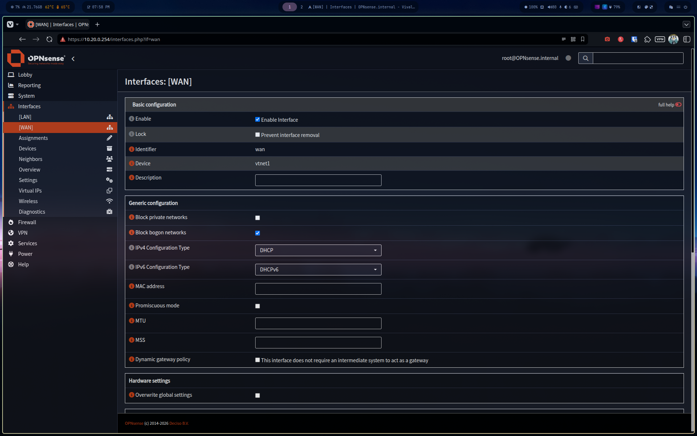
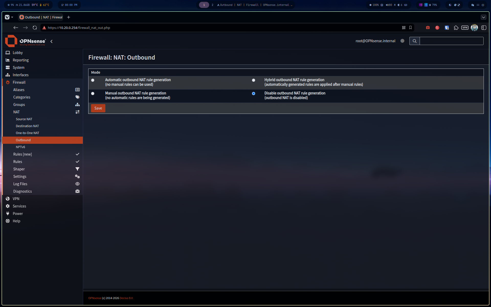

# 01 — Network & VMs (Phase 1)

## Architecture

```
k3s-net (10.10.0.0/24) — NAT
├── Load-srvs        10.10.0.10
├── K3s-srv-1        10.10.0.11
├── K3s-srv-2        10.10.0.12
├── K3s-srv-3        10.10.0.13
├── K3s-db           10.10.0.20
├── K3s-agent-node-1 10.10.0.31
├── K3s-agent-node-2 10.10.0.32
├── K3s-agent-node-3 10.10.0.33
└── OPNsense (WAN)   10.10.0.254

monitoring-net (10.20.0.0/24) — NAT
├── Zabbix-srv       10.20.0.10
├── Wazuh-srv        10.20.0.11
├── Prometheus-srv   10.20.0.12
├── Grafana-srv      10.20.0.13
└── OPNsense (LAN)   10.20.0.254
```

---

## Creating the monitoring-net network

Created from virt-manager:

```
Edit → Connection Details → Virtual Networks → +
Name    : monitoring-net
Mode    : NAT
Subnet  : 10.20.0.0/24
Gateway : 10.20.0.1
DHCP    : 10.20.0.100 - 10.20.0.254
```


---

## Creating the 4 monitoring VMs

| VM | RAM | Disk | vCPU | Network |
|---|---|---|---|---|
| Zabbix-srv | 4GB | 40GB | 2 | monitoring-net |
| Wazuh-srv | 6GB | 60GB | 4 | monitoring-net |
| Prometheus-srv | 2GB | 30GB | 2 | monitoring-net |
| Grafana-srv | 1GB | 20GB | 2 | monitoring-net |

OS: Ubuntu 26.04 LTS Server


---

## Static IP reservations (DHCP)

```bash
sudo virsh net-update monitoring-net add ip-dhcp-host \
  "<host mac='52:54:00:11:26:13' name='Zabbix-srv' ip='10.20.0.10'/>" \
  --live --config

sudo virsh net-update monitoring-net add ip-dhcp-host \
  "<host mac='52:54:00:88:f8:5f' name='Wazuh-srv' ip='10.20.0.11'/>" \
  --live --config

sudo virsh net-update monitoring-net add ip-dhcp-host \
  "<host mac='52:54:00:67:6c:b3' name='Prometheus-srv' ip='10.20.0.12'/>" \
  --live --config

sudo virsh net-update monitoring-net add ip-dhcp-host \
  "<host mac='52:54:00:b0:64:bb' name='Grafana-srv' ip='10.20.0.13'/>" \
  --live --config
```


---

## SSH key deployment

```bash
ssh-copy-id zabbix-admin@10.20.0.10
ssh-copy-id wazuh-admin@10.20.0.11
ssh-copy-id prometheus-admin@10.20.0.12
ssh-copy-id grafana-admin@10.20.0.13
```


---

## monitoring-start/stop aliases

Added to `~/.config/zsh/.zshrc`:

```bash
alias monitoring-start="for vm in Zabbix-srv Wazuh-srv Prometheus-srv Grafana-srv; do sudo virsh start \$vm; done"
alias monitoring-stop="for vm in Zabbix-srv Wazuh-srv Prometheus-srv Grafana-srv; do sudo virsh shutdown \$vm; done"
```


---

## OPNsense router

### Problem

The two networks (`k3s-net` and `monitoring-net`) are isolated by libvirt. Traffic between them is masqueraded — the source IP is replaced by the libvirt gateway, making inter-network routing impossible.


### Solution

Deployment of **OPNsense 26.1** as a dedicated router between the two networks.

| Interface | Network | IP |
|---|---|---|
| WAN (vtnet1) | k3s-net | 10.10.0.254 |
| LAN (vtnet0) | monitoring-net | 10.20.0.254 |

```
VM Name  : Opnsense
RAM      : 1024 MB
CPU      : 2
Disk     : 8 GB
```


### OPNsense configuration

**Interfaces → [WAN]**: disable "Block private networks"



**Firewall → NAT → Outbound**: set to "Disable"



### Libvirt masquerade fix

Libvirt uses nftables/iptables to masquerade all outgoing traffic. RETURN rules are added to the `LIBVIRT_PRT` chain to exempt inter-network traffic:

```bash
sudo iptables -t nat -I LIBVIRT_PRT 1 -s 10.10.0.0/24 -d 10.20.0.0/24 -j RETURN
sudo iptables -t nat -I LIBVIRT_PRT 1 -s 10.20.0.0/24 -d 10.10.0.0/24 -j RETURN
```

Persisted via systemd:

```bash
sudo sh -c "iptables-save > /etc/iptables/iptables.rules"
sudo systemctl enable iptables
```

Libvirt firewall backend change:

```bash
# /etc/libvirt/network.conf
firewall_backend = "iptables"
```

---

## Persistent routes via Netplan

### On the 6 K3s nodes

File `/etc/netplan/99-routes.yaml`:

```yaml
network:
  version: 2
  ethernets:
    enp1s0:
      routes:
        - to: 10.20.0.0/24
          via: 10.10.0.254
```

Deployed to all nodes:

```bash
for node in 10.10.0.11 10.10.0.12 10.10.0.13 10.10.0.31 10.10.0.32 10.10.0.33; do
  scp /tmp/99-routes.yaml k3s-admin@$node:/tmp/
  ssh -t k3s-admin@$node "sudo mv /tmp/99-routes.yaml /etc/netplan/ && \
    sudo chmod 600 /etc/netplan/99-routes.yaml && sudo netplan apply"
done
```


### On the 4 monitoring VMs

File `/etc/netplan/99-routes.yaml`:

```yaml
network:
  version: 2
  ethernets:
    enp1s0:
      routes:
        - to: 10.10.0.0/24
          via: 10.20.0.254
```


---

## Final verification

```bash
# K3s → Monitoring
ssh k3s-admin@10.10.0.11 "ping -c 2 10.20.0.10"

# Monitoring → K3s
ssh zabbix-admin@10.20.0.10 "ping -c 2 10.10.0.11"
```


```
✅ k3s-net    → monitoring-net  0% packet loss
✅ monitoring-net → k3s-net     0% packet loss
```

---

## MAC and IP summary

| VM | MAC (monitoring-net) | IP |
|---|---|---|
| Zabbix-srv | 52:54:00:11:26:13 | 10.20.0.10 |
| Wazuh-srv | 52:54:00:88:f8:5f | 10.20.0.11 |
| Prometheus-srv | 52:54:00:67:6c:b3 | 10.20.0.12 |
| Grafana-srv | 52:54:00:b0:64:bb | 10.20.0.13 |
| OPNsense WAN | 52:54:00:09:02:ed | 10.10.0.254 |
| OPNsense LAN | 52:54:00:a7:c0:fc | 10.20.0.254 |
