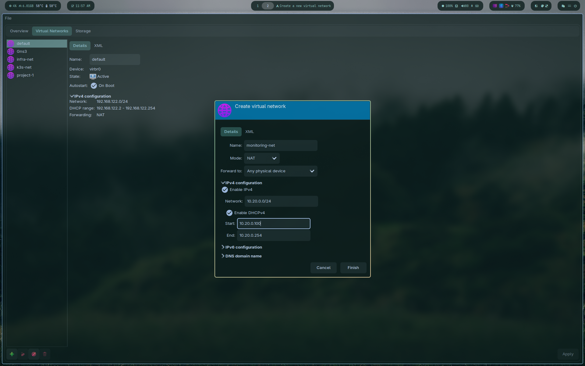
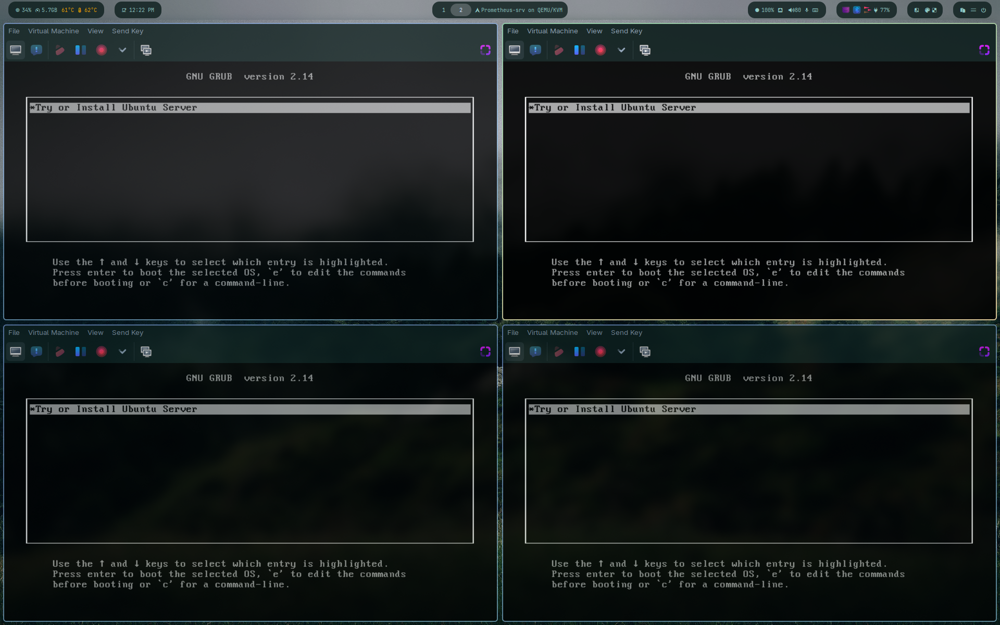
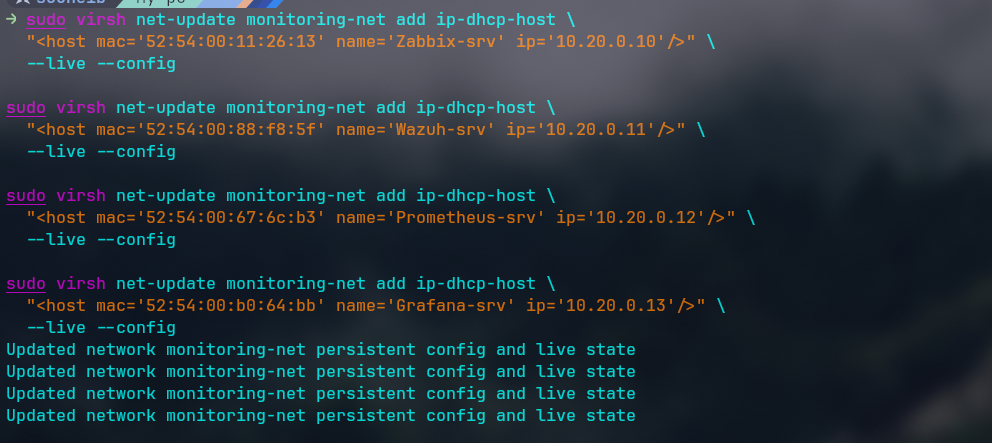
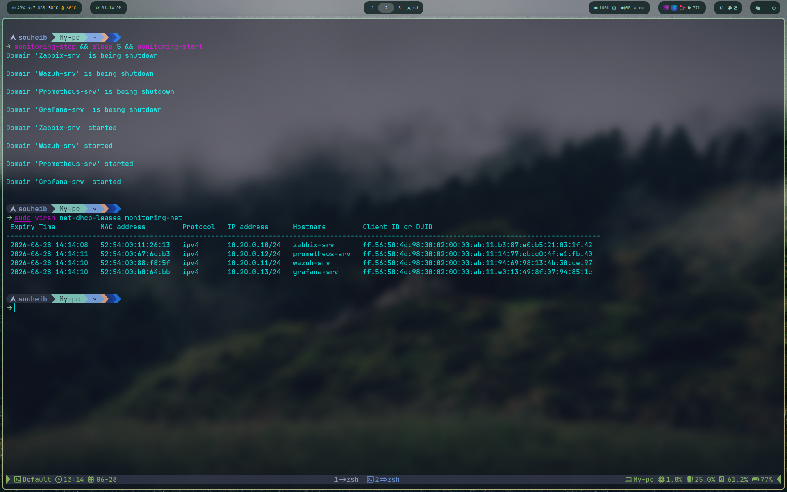

# 01 — Réseau & VMs (Phase 1)

## Architecture

```
k3s-net (10.10.0.0/24) — NAT
├── Load-srvs        10.10.0.10
├── K3s-srv-1        10.10.0.11
├── K3s-srv-2        10.10.0.12
├── K3s-srv-3        10.10.0.13
├── K3s-db           10.10.0.20
├── K3s-agent-node-1 10.10.0.31
├── K3s-agent-node-2 10.10.0.32
├── K3s-agent-node-3 10.10.0.33
└── OPNsense (WAN)   10.10.0.254

monitoring-net (10.20.0.0/24) — NAT
├── Zabbix-srv       10.20.0.10
├── Wazuh-srv        10.20.0.11
├── Prometheus-srv   10.20.0.12
├── Grafana-srv      10.20.0.13
└── OPNsense (LAN)   10.20.0.254
```

---

## Création du réseau monitoring-net

Créé depuis virt-manager :

```
Edit → Connection Details → Virtual Networks → +
Nom     : monitoring-net
Mode    : NAT
Subnet  : 10.20.0.0/24
Gateway : 10.20.0.1
DHCP    : 10.20.0.100 - 10.20.0.254
```



---

## Création des 4 VMs monitoring

|VM|RAM|Disk|vCPU|Réseau|
|---|---|---|---|---|
|Zabbix-srv|4GB|40GB|2|monitoring-net|
|Wazuh-srv|6GB|60GB|4|monitoring-net|
|Prometheus-srv|2GB|30GB|2|monitoring-net|
|Grafana-srv|1GB|20GB|2|monitoring-net|

OS : Ubuntu 26.04 LTS Server




---

## Réservation des IPs statiques (DHCP)

```bash
sudo virsh net-update monitoring-net add ip-dhcp-host \
  "<host mac='52:54:00:11:26:13' name='Zabbix-srv' ip='10.20.0.10'/>" \
  --live --config

sudo virsh net-update monitoring-net add ip-dhcp-host \
  "<host mac='52:54:00:88:f8:5f' name='Wazuh-srv' ip='10.20.0.11'/>" \
  --live --config

sudo virsh net-update monitoring-net add ip-dhcp-host \
  "<host mac='52:54:00:67:6c:b3' name='Prometheus-srv' ip='10.20.0.12'/>" \
  --live --config

sudo virsh net-update monitoring-net add ip-dhcp-host \
  "<host mac='52:54:00:b0:64:bb' name='Grafana-srv' ip='10.20.0.13'/>" \
  --live --config
```






---

## Copie des clés SSH

```bash
ssh-copy-id zabbix-admin@10.20.0.10
ssh-copy-id wazuh-admin@10.20.0.11
ssh-copy-id prometheus-admin@10.20.0.12
ssh-copy-id grafana-admin@10.20.0.13
```


---

## Aliases monitoring-start/stop

Ajoutés dans `~/.config/zsh/.zshrc` :

```bash
alias monitoring-start="for vm in Zabbix-srv Wazuh-srv Prometheus-srv Grafana-srv; do sudo virsh start \$vm; done"
alias monitoring-stop="for vm in Zabbix-srv Wazuh-srv Prometheus-srv Grafana-srv; do sudo virsh shutdown \$vm; done"
```


---

## Routeur OPNsense

### Problème

Les deux réseaux (`k3s-net` et `monitoring-net`) sont isolés par libvirt. Le trafic entre eux est masquerade — l'IP source est remplacée par la gateway libvirt, rendant le routing impossible.


### Solution

Déploiement d'**OPNsense 26.1** comme routeur dédié entre les deux réseaux.

|Interface|Réseau|IP|
|---|---|---|
|WAN (vtnet1)|k3s-net|10.10.0.254|
|LAN (vtnet0)|monitoring-net|10.20.0.254|

```
VM Name  : Opnsense
RAM      : 1024 MB
CPU      : 2
Disk     : 8 GB
```


### Configuration OPNsense

**Interfaces → [WAN]** : désactiver "Block private networks"


**Firewall → NAT → Outbound** : mode "Disable"


### Fix du masquerading libvirt

Libvirt utilise nftables/iptables pour masquerader tout le trafic sortant. On ajoute des règles RETURN dans la chaîne `LIBVIRT_PRT` pour exclure le trafic inter-réseaux :

```bash
sudo iptables -t nat -I LIBVIRT_PRT 1 -s 10.10.0.0/24 -d 10.20.0.0/24 -j RETURN
sudo iptables -t nat -I LIBVIRT_PRT 1 -s 10.20.0.0/24 -d 10.10.0.0/24 -j RETURN
```

Persistance via systemd :

```bash
sudo sh -c "iptables-save > /etc/iptables/iptables.rules"
sudo systemctl enable iptables
```

Changement du backend firewall libvirt :

```bash
# /etc/libvirt/network.conf
firewall_backend = "iptables"
```

---

## Routes persistantes via Netplan

### Sur les 6 nodes K3s

Fichier `/etc/netplan/99-routes.yaml` :

```yaml
network:
  version: 2
  ethernets:
    enp1s0:
      routes:
        - to: 10.20.0.0/24
          via: 10.10.0.254
```

Déployé sur tous les nodes :

```bash
for node in 10.10.0.11 10.10.0.12 10.10.0.13 10.10.0.31 10.10.0.32 10.10.0.33; do
  scp /tmp/99-routes.yaml k3s-admin@$node:/tmp/
  ssh -t k3s-admin@$node "sudo mv /tmp/99-routes.yaml /etc/netplan/ && \
    sudo chmod 600 /etc/netplan/99-routes.yaml && sudo netplan apply"
done
```


### Sur les 4 VMs monitoring

Fichier `/etc/netplan/99-routes.yaml` :

```yaml
network:
  version: 2
  ethernets:
    enp1s0:
      routes:
        - to: 10.10.0.0/24
          via: 10.20.0.254
```


---

## Vérification finale

```bash
# K3s → Monitoring
ssh k3s-admin@10.10.0.11 "ping -c 2 10.20.0.10"

# Monitoring → K3s
ssh zabbix-admin@10.20.0.10 "ping -c 2 10.10.0.11"
```


```
✅ k3s-net    → monitoring-net  0% packet loss
✅ monitoring-net → k3s-net     0% packet loss
```

---

## Résumé MACs et IPs

| VM             | MAC (monitoring-net) | IP monitoring |
| -------------- | -------------------- | ------------- |
| Zabbix-srv     | 52:54:00:11:26:13    | 10.20.0.10    |
| Wazuh-srv      | 52:54:00:88:f8:5f    | 10.20.0.11    |
| Prometheus-srv | 52:54:00:67:6c:b3    | 10.20.0.12    |
| Grafana-srv    | 52:54:00:b0:64:bb    | 10.20.0.13    |
| OPNsense WAN   | 52:54:00:09:02:ed    | 10.10.0.254   |
| OPNsense LAN   | 52:54:00:a7:c0:fc    | 10.20.0.254   |
