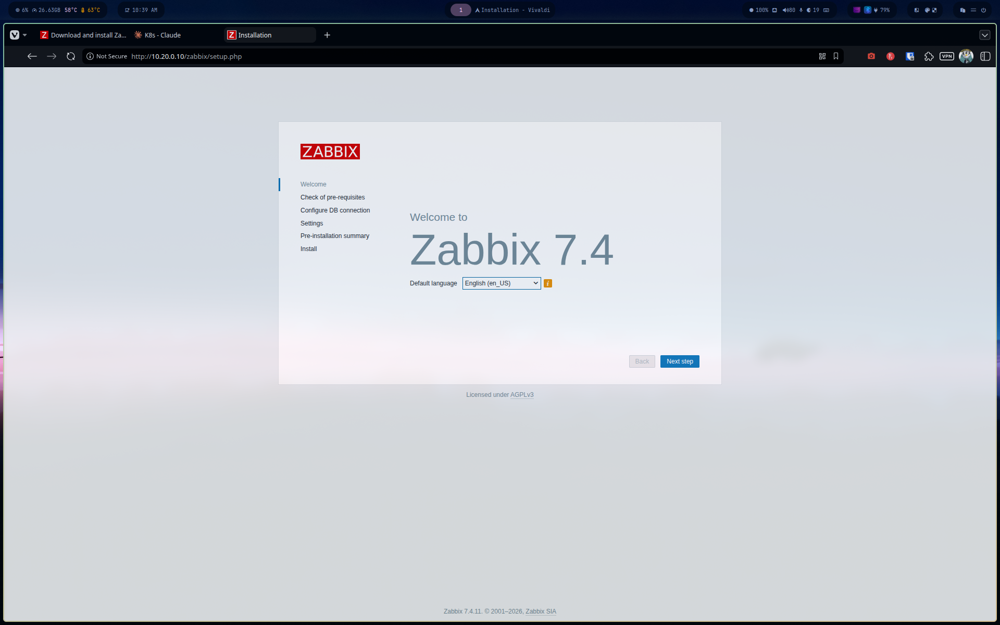
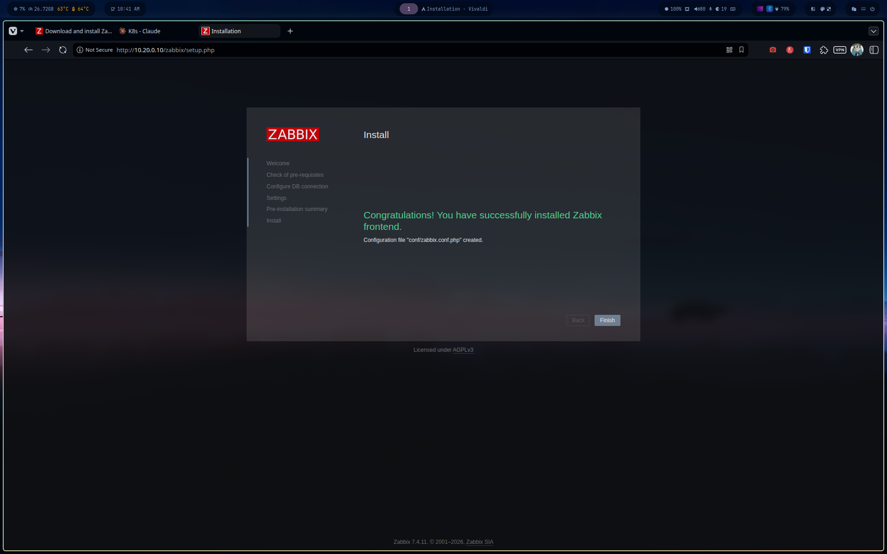
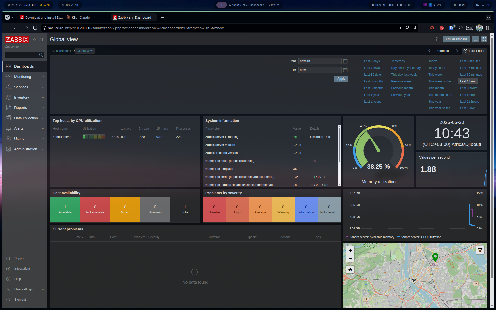

# Phase 2 — Zabbix Server Installation

**VM:** Zabbix-srv (10.20.0.10)
**OS:** Ubuntu 26.04 "Resolute"
**Zabbix version:** 7.4.11 (official repo)
**Stack:** MySQL 8.4 + Apache + PHP 8.5

## 1. Add official Zabbix repository

```bash
sudo -s
wget https://repo.zabbix.com/zabbix/7.4/release/ubuntu/pool/main/z/zabbix-release/zabbix-release_latest_7.4+ubuntu26.04_all.deb
dpkg -i zabbix-release_latest_7.4+ubuntu26.04_all.deb
apt update
```

## 2. Install Zabbix server, frontend, agent

```bash
apt install zabbix-server-mysql zabbix-frontend-php zabbix-apache-conf zabbix-sql-scripts zabbix-agent -y
```

> Note: this does **not** pull `mysql-server` automatically — only client libs as a dependency. Install it explicitly:

```bash
apt install mysql-server -y
systemctl start mysql
systemctl enable mysql
systemctl status mysql
```

## 3. Create the database

```bash
mysql -uroot -p
```

```sql
CREATE DATABASE zabbix CHARACTER SET utf8mb4 COLLATE utf8mb4_bin;
CREATE USER zabbix@localhost IDENTIFIED BY 'your_password_here';
GRANT ALL PRIVILEGES ON zabbix.* TO zabbix@localhost;
SET GLOBAL log_bin_trust_function_creators = 1;
QUIT;
```

## 4. Import initial schema

```bash
zcat /usr/share/zabbix/sql-scripts/mysql/server.sql.gz | mysql --default-character-set=utf8mb4 -uzabbix -p zabbix
```

Disable the temporary flag once import is done:

```bash
mysql -uroot -p
```

```sql
SET GLOBAL log_bin_trust_function_creators = 0;
QUIT;
```

## 5. Configure Zabbix server

Edit `/etc/zabbix/zabbix_server.conf`:

```
DBName=zabbix
DBUser=zabbix
DBPassword=your_password_here
```

Start services:

```bash
systemctl restart zabbix-server zabbix-agent apache2
systemctl enable zabbix-server zabbix-agent apache2
```

## 6. Web installer

Navigate to `http://10.20.0.10/zabbix/setup.php`.

| Step | Value |
|---|---|
| Database connection | host: `localhost`, user: `zabbix`, password: set above |
| Zabbix server name | `Zabbix-srv` |
| Default time zone | UTC |
| Default theme | Dark |




## 7. First login

Default credentials: `Admin` / `zabbix`

> Kept default for this lab session — flagged for change before any exposure beyond `monitoring-net`.





## Result

- Zabbix server running, self-monitoring active (1 host: "Zabbix server")
- 360 templates loaded, 135 items, 78 triggers imported with default schema
- Dashboard reachable at `http://10.20.0.10/zabbix`

