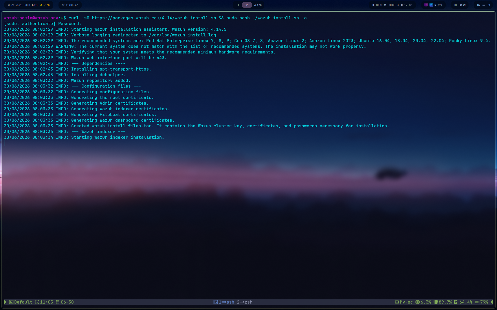
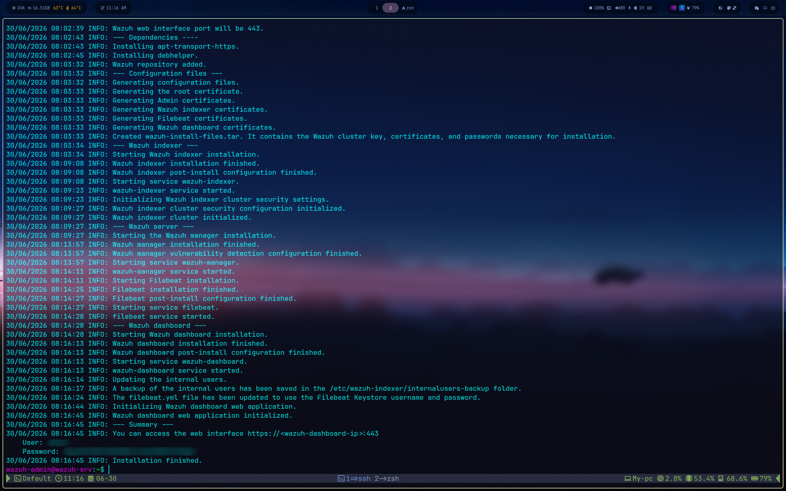
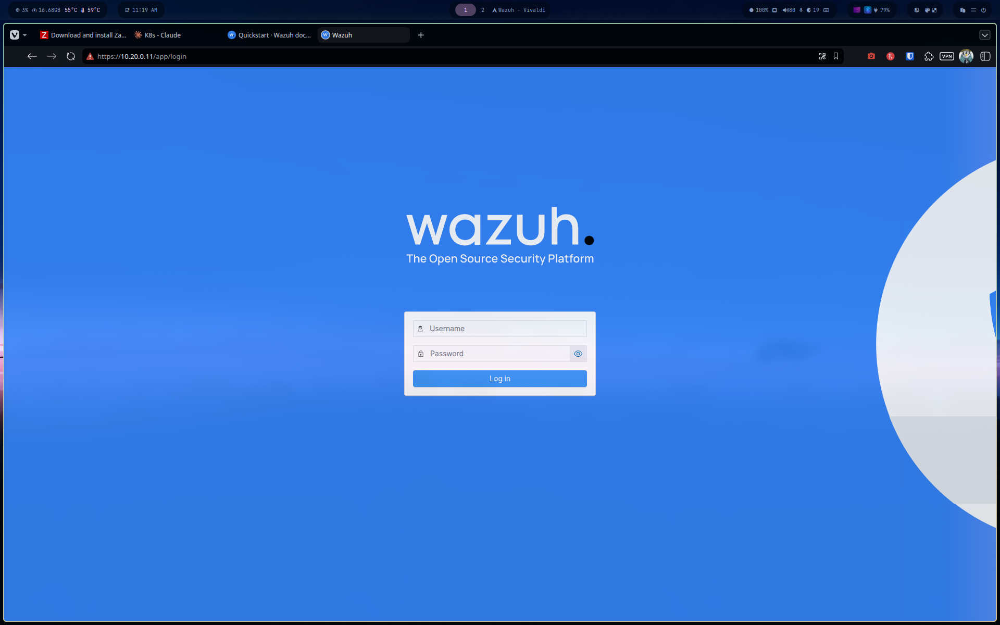
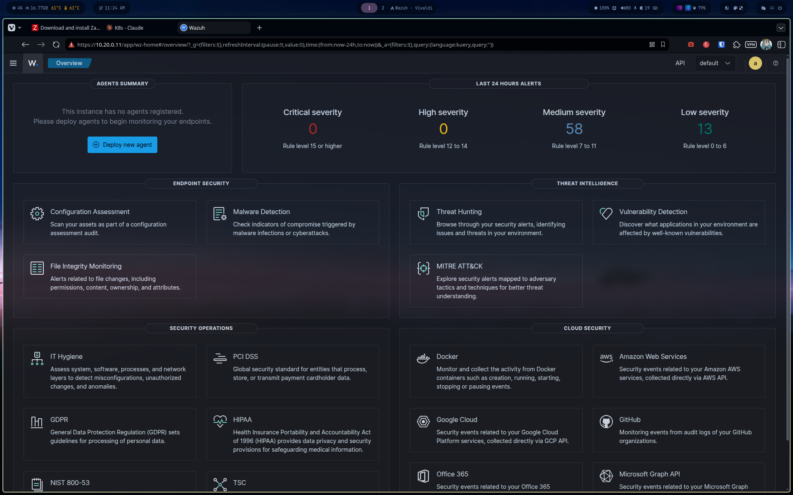

# Phase 2 — Wazuh Server Installation

**VM:** Wazuh-srv (10.20.0.11) **OS:** Ubuntu 26.04 "Resolute" **Wazuh version:** 4.14.5 **Mode:** All-in-one (indexer + manager + dashboard on a single host)

## 1. Pre-install: resource check

Wazuh quickstart hardware requirements (1-25 agents): 4 vCPU, 8 GiB RAM, 50 GB storage.

Initial VM specs were under the recommended RAM (5.3 GiB). Bumped to 8 GiB before installing:

```bash
# from host
sudo virsh shutdown Wazuh-srv
sudo virsh setmaxmem Wazuh-srv 8G --config
sudo virsh setmem Wazuh-srv 8G --config
sudo virsh start Wazuh-srv
```

Confirmed on guest:

```bash
free -h
# 7.3Gi total — close enough to the 8GiB target (KVM overhead)
```

## 2. Run the quickstart installer

All-in-one was chosen since this lab uses a single dedicated VM for Wazuh, not a distributed cluster — the quickstart script handles cert generation (root CA, indexer, filebeat, dashboard certs) automatically, which is the most error-prone part of a manual install.

```bash
curl -sO https://packages.wazuh.com/4.14/wazuh-install.sh && sudo bash ./wazuh-install.sh -a
```

> Note: Ubuntu 26.04 isn't in Wazuh's officially recommended OS list (script warns about this), but the install completed without issues — purely a documentation lag on Wazuh's side, not a real compatibility problem.

Install phases and timing observed:

|Phase|Duration|
|---|---|
|Dependencies + repo setup|~50s|
|Certificate generation|~1s|
|Wazuh indexer|~5.5 min|
|Wazuh manager + Filebeat|~5 min|
|Wazuh dashboard|~2 min|
|**Total**|**~14 min**|





At the end, the script prints the dashboard URL and generated `admin` credentials. **Save these immediately** — some versions don't reprint them after this point.

## 3. First login

Navigate to `https://10.20.0.11`. Self-signed certificate warning is expected (locally generated by the install script, not a public CA) — accept the exception.





## Result

- Indexer, manager, filebeat, and dashboard all running with no errors
- Dashboard reachable at `https://10.20.0.11`
- Self-monitoring active: 58 medium-severity and 13 low-severity alerts already logged in the first 24h from the manager's own vulnerability detection, with zero agents deployed yet

## Side note: host resource audit

Mid-install, host RAM dropped to ~3 GiB available (no swap configured) due to over-allocated K3s VMs running idle in parallel. Resolved by shutting down the K3s stack (not needed during Wazuh install) and resizing K3s node RAM allocations down from ~9.1 GiB to 4 GiB each — cuts ~22.5 GB of allocated-but-unused RAM across the 7 K3s VMs.

