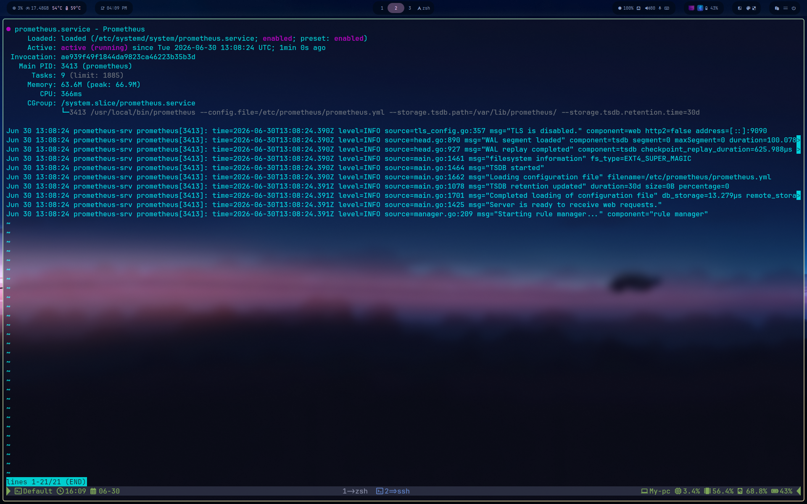
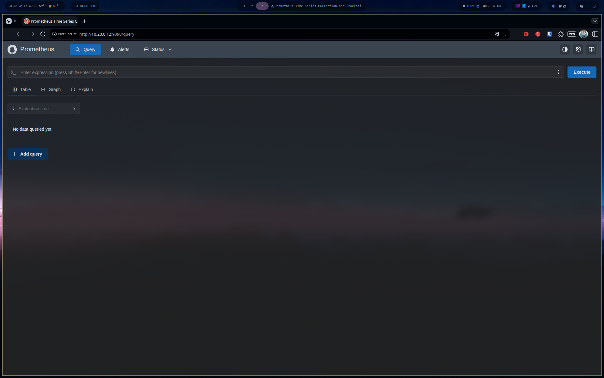

# Phase 2 — Prometheus Server Installation

**VM:** Prometheus-srv (10.20.0.12)
**OS:** Ubuntu 26.04 "Resolute"
**Prometheus version:** 3.12.0
**Mode:** Static binary, systemd-managed, dedicated service account

## 1. Dedicated service user

Prometheus runs under a dedicated system account rather than root or the admin user — least-privilege principle: a future CVE in the binary stays contained to this account's permissions instead of granting broader access.

```bash
sudo useradd --no-create-home --shell /bin/false prometheus
```

`--no-create-home --shell /bin/false` means this account exists only to own files and run the process — no home directory, no interactive login possible.

## 2. Directories

```bash
sudo mkdir -p /etc/prometheus /var/lib/prometheus
```

## 3. Download and install the binary

No official apt repository is maintained by the Prometheus project — static binaries from GitHub releases are the standard distribution method.

```bash
curl -s https://api.github.com/repos/prometheus/prometheus/releases/latest | grep tag_name
# v3.12.0

cd /tmp
wget https://github.com/prometheus/prometheus/releases/download/v3.12.0/prometheus-3.12.0.linux-amd64.tar.gz
tar xvfz prometheus-3.12.0.linux-amd64.tar.gz
cd prometheus-3.12.0.linux-amd64

sudo cp prometheus promtool /usr/local/bin/
sudo cp prometheus.yml /etc/prometheus/

sudo chown -R prometheus:prometheus /etc/prometheus /var/lib/prometheus
sudo chown prometheus:prometheus /usr/local/bin/prometheus /usr/local/bin/promtool
```

> Note: Prometheus v3.x dropped the legacy `consoles/` and `console_libraries/` directories present in v2.x tutorials — the old console-template system was replaced by the modern built-in React UI. Any guide referencing `--web.console.templates` / `--web.console.libraries` is outdated for v3.x; these flags and directories no longer exist in the release tarball.

## 4. systemd service

Retention extended to 30 days (default is 15) — more historical data useful for a lab environment.

```bash
sudo tee /etc/systemd/system/prometheus.service > /dev/null <<'EOF'
[Unit]
Description=Prometheus
Wants=network-online.target
After=network-online.target

[Service]
User=prometheus
Group=prometheus
Type=simple
ExecStart=/usr/local/bin/prometheus \
  --config.file=/etc/prometheus/prometheus.yml \
  --storage.tsdb.path=/var/lib/prometheus/ \
  --storage.tsdb.retention.time=30d

[Install]
WantedBy=multi-user.target
EOF

sudo systemctl daemon-reload
sudo systemctl start prometheus
sudo systemctl enable prometheus
sudo systemctl status prometheus
```



## 5. Verification

Web UI reachable at `http://10.20.0.12:9090`.



Checked under **Status → Target health**: the default self-scrape job (`job="prometheus"`, `instance="localhost:9090"`) reports `1/1 up`, ~2ms scrape latency, confirming Prometheus is both running and actively collecting its own metrics — not just alive as a process.

## Result

- Prometheus 3.12.0 running as a dedicated `prometheus` system user
- Service enabled at boot, 30-day retention configured
- Self-scrape target healthy (`up == 1`)
- Memory footprint: ~63 MB at idle

