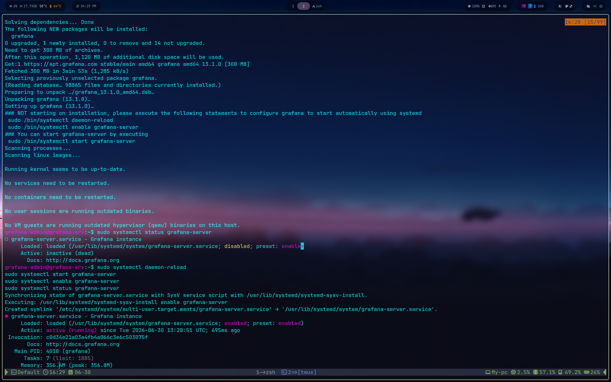

# Phase 2 — Grafana Server Installation

**VM:** Grafana-srv (10.20.0.13) **OS:** Ubuntu 26.04 "Resolute" **Grafana version:** 13.1.0 (OSS, official apt repo)

## 1. Dependencies

```bash
sudo apt-get install -y apt-transport-https wget gnupg
```

## 2. Add the official Grafana apt repository

```bash
sudo mkdir -p /etc/apt/keyrings
sudo wget -O /etc/apt/keyrings/grafana.asc https://apt.grafana.com/gpg-full.key
sudo chmod 644 /etc/apt/keyrings/grafana.asc

echo "deb [signed-by=/etc/apt/keyrings/grafana.asc] https://apt.grafana.com stable main" | sudo tee -a /etc/apt/sources.list.d/grafana.list
echo "deb [signed-by=/etc/apt/keyrings/grafana.asc] https://apt.grafana.com beta main" | sudo tee -a /etc/apt/sources.list.d/grafana.list

sudo apt-get update
```

> Chose the apt repo over a standalone `.deb` so future version upgrades go through normal `apt upgrade` rather than manual re-downloads — consistent with the Zabbix install approach.

## 3. Install Grafana OSS

```bash
sudo apt-get install grafana
```

> Note: a `grafana-enterprise` `.deb` was initially downloaded directly from Grafana's release page. Without an activated license key, Enterprise behaves identically to OSS — paid features simply stay locked. Switched to the OSS apt package instead for a cleaner licensing story and proper update management.

## 4. Enable and start the service

The package does not auto-start on install:

```bash
sudo systemctl daemon-reload
sudo systemctl enable grafana-server
sudo systemctl start grafana-server
sudo systemctl status grafana-server
```



## 5. First login

Web UI reachable at `http://10.20.0.13:3000`.

Default credentials: `admin` / `admin` — Grafana forces a password change on first login automatically (unlike Zabbix, no manual step needed here).


## Result

- Grafana 13.1.0 OSS running as systemd service, enabled at boot
- Memory footprint: ~356 MB at idle
- Dashboard reachable at `http://10.20.0.13:3000`
- Password change enforced on first login

