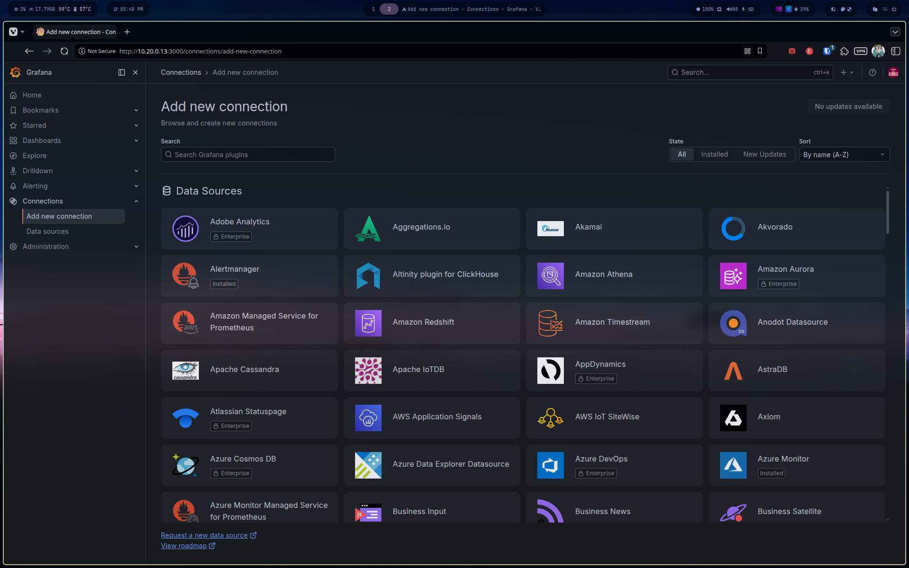
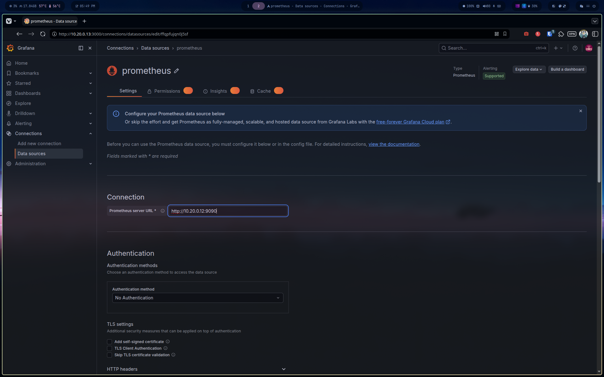
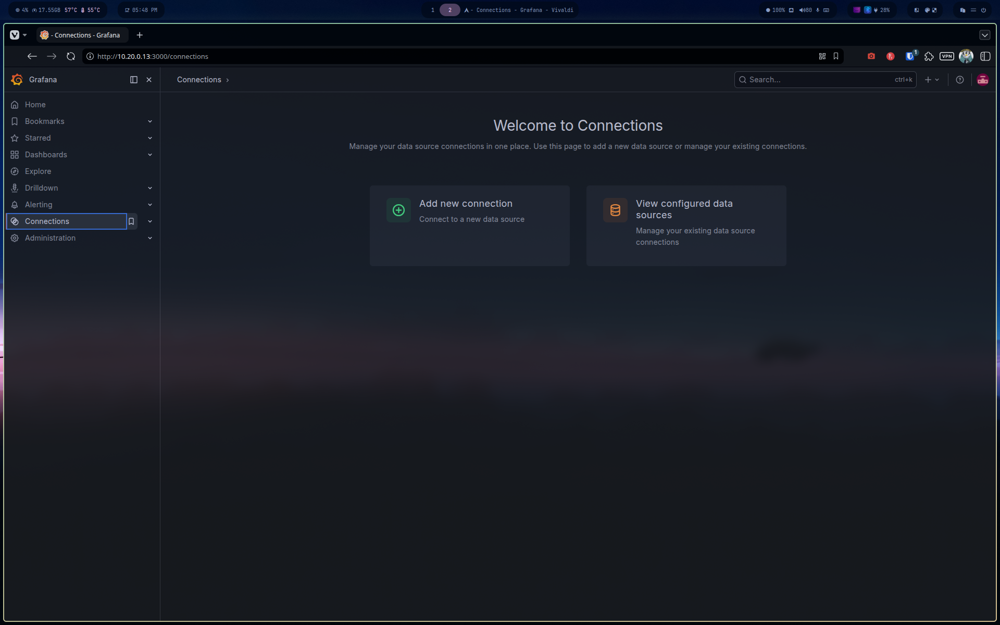
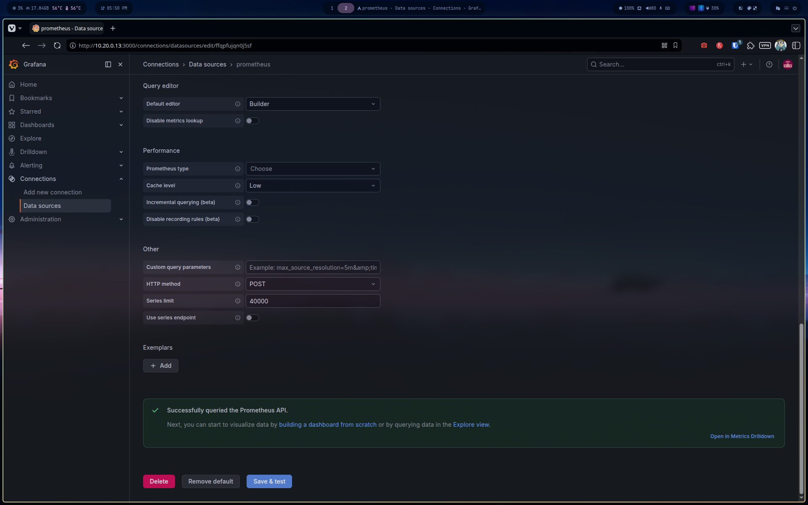
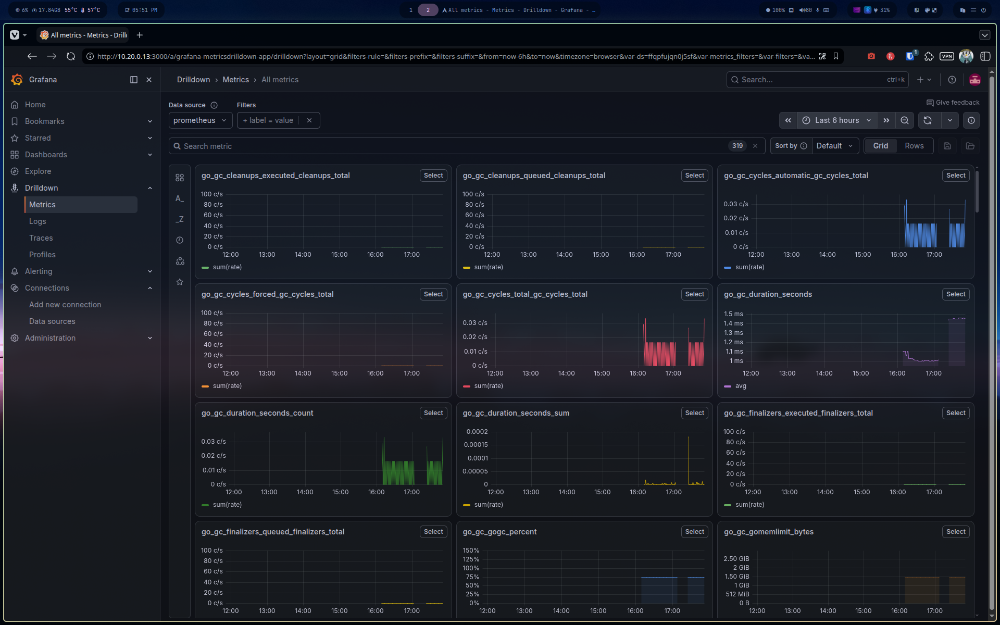
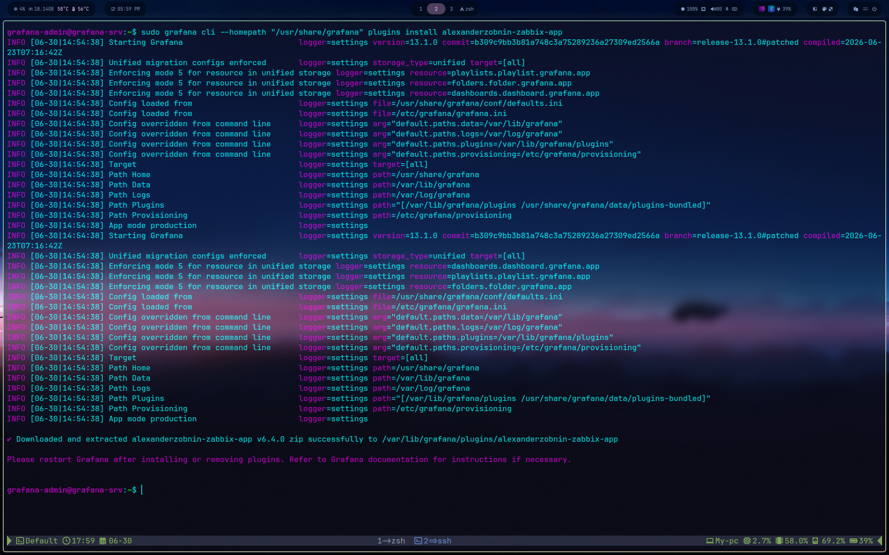
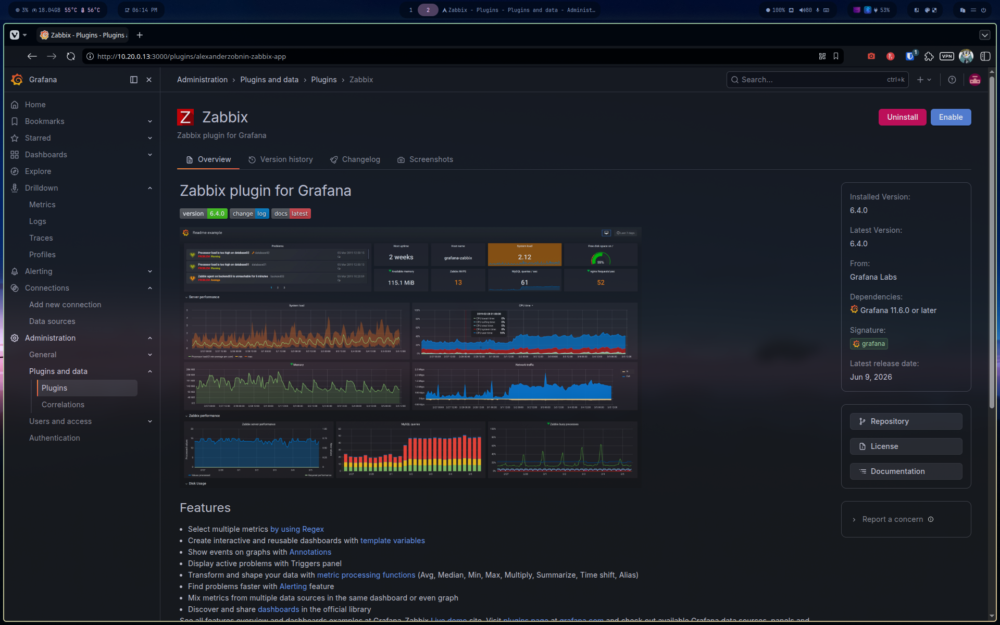
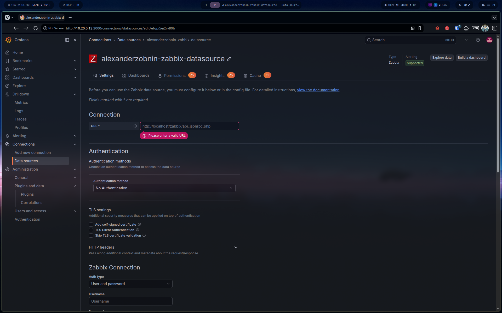

# Phase 3 — NOC Configuration (Grafana Datasources)

## Prometheus datasource — ✅ Connected

**Connections → Add new data source → Prometheus**



```
URL: http://10.20.0.12:9090
Auth: None
```





Save & test confirmed working immediately.



Verified beyond the test button itself by browsing **Drilldown → Metrics**: 319 metrics available from Prometheus's own self-scrape (`go_gc_*`, runtime stats), rendering live graphs over the last 6 hours — confirms the datasource is not just reachable but actively returning queryable time series data.




## Zabbix datasource — ❌ Removed from stack

**See [DECISIONS.md — ADR-001](K3s-lab-monitoring/DECISIONS.md) for the full architectural decision and reasoning.**

In summary: after exhaustive troubleshooting of the Grafana-Zabbix plugin integration, and a review of Zabbix's role in this specific stack, Zabbix was removed from the active monitoring architecture. Every capability it would have provided is already covered by Wazuh (SOC/security) and Prometheus (metrics/NOC).

### Plugin installation troubleshooting

The plugin install itself required several non-obvious fixes before it would even load:

1. **`grafana-cli` / `grafana cli` broken on this build** — both the deprecated and new CLI syntax either failed with `Could not find config defaults` or launched a full foreground Grafana server instead of running the install command. Worked around by forcing `--homepath "/usr/share/grafana"` explicitly.
2. **Ownership bug** — plugin files installed via `grafana-cli` were owned by `root:root` instead of `grafana:grafana`, silently preventing the `grafana-server` process (running as the `grafana` user) from loading the plugin. Fixed with `chown -R grafana:grafana`.
3. **Plugin registered but not enabled** — even with correct ownership and a valid signature, the plugin doesn't auto-activate. Found under **Administration → Plugins and data → Plugins → Zabbix → Enable**. This step is easy to miss since the plugin appears installed and even runs as a backend process without it.





### Connection troubleshooting

Once enabled, datasource setup was attempted:



**Save & test** consistently failed regardless of auth method:

- **User and password**: hangs for exactly 60 seconds → `Zabbix authentication error: context deadline exceeded`
- **API token**: fails immediately → `Could not connect to given url`
- **Direct DB Connection via MySQL**: MySQL datasource connected successfully and raw SQL queries returned live Zabbix data — but the plugin still requires a working API auth before allowing Direct DB Connection to function

**Eliminated as causes** (each independently verified):

| Hypothesis | Test | Result |
|---|---|---|
| Network/firewall between Grafana-srv and Zabbix-srv | `curl -X POST` to the API endpoint from Grafana-srv | 13ms response, valid JSON-RPC result |
| Wrong credentials | Manual login to Zabbix web UI with same `Admin` credentials | Successful |
| Zabbix account locked (brute-force protection) | Direct web login test | Not locked |
| File permission issue on plugin binary | `ls -la` on the datasource binary | Correct `-rwxr-xr-x`, owned by `grafana` |
| Unsigned plugin blocked | Checked plugin signature status in UI | Signed, `grafana` signature confirmed |
| No internet access for plugin version checks | `curl` to `grafana.com/api/plugins/...` from Grafana-srv | 200 OK, fast response |
| Plugin version incompatibility (6.4.0) | Downgraded to plugin v6.3.0 then v6.2.0 | Same error across all versions |
| Grafana version incompatibility (13.1.0) | Downgraded Grafana to 12.4.5 | Same error |

Root cause: Zabbix 7.4 removed the legacy `auth` parameter from JSON-RPC, and `Authorization: Bearer` header auth also fails — a known upstream issue confirmed in [grafana/grafana-zabbix#1957](https://github.com/grafana/grafana-zabbix/issues/1957). Plugin versions 6.2.0, 6.3.0, and 6.4.0 were tested across Grafana 12.4.5 and 13.1.0 — none resolved the issue.

## Dashboard imports

NOC dashboards will use **Prometheus exclusively** as the datasource.

- `node_exporter` deployment on all monitored VMs (K3s nodes + monitoring VMs) is deferred to **Phase 5 (Ansible)**
- Once exporters are deployed, Prometheus scrape config will be extended with all targets
- Dashboard to import: **Node Exporter Full** (Grafana dashboard ID `1860`) — community standard, 30M+ downloads, covers CPU, memory, disk, network, filesystem per host
