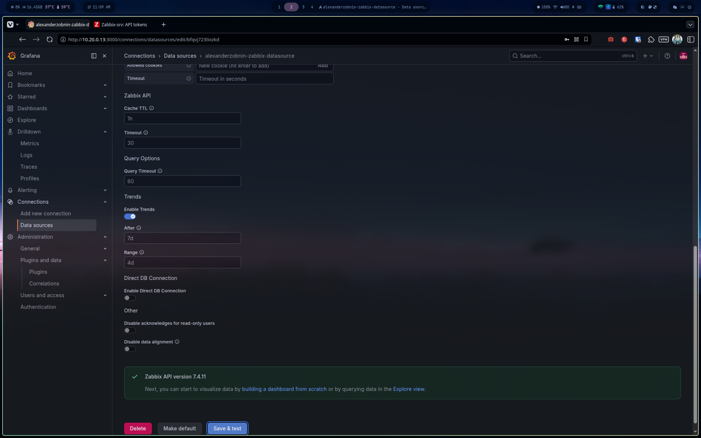

# Phase 3 — NOC Configuration (Grafana Datasources)

## Prometheus datasource — ✅ Connected

**Connections → Add new data source → Prometheus**


```
URL: http://10.20.0.12:9090
Auth: None
```


Save & test confirmed working immediately.


Verified via **Drilldown → Metrics**: 319 metrics available from Prometheus's self-scrape, rendering live graphs — confirms the datasource is actively returning queryable time series data, not just reachable.


---

## Zabbix datasource — ✅ Connected

**Plugin:** `alexanderzobnin-zabbix-app` v6.4.0

### 1. Install the plugin

```bash
sudo grafana-cli --homepath "/usr/share/grafana" plugins install alexanderzobnin-zabbix-app
sudo chown -R grafana:grafana /var/lib/grafana/plugins/alexanderzobnin-zabbix-app
sudo systemctl restart grafana-server
```

> Note: the standard `grafana-cli` command (without `--homepath`) fails on this build — use the explicit homepath.
> After install, ownership must be set to `grafana:grafana` manually — the CLI installs as `root:root` which silently prevents the plugin from loading.

### 2. Enable the plugin

**Administration → Plugins and data → Plugins → Zabbix → Enable**


> The plugin won't appear in the datasource list until explicitly enabled here — it registers and runs as a background process but stays inactive until toggled on.

### 3. Pre-requisite: fix Apache Authorization header passthrough on Zabbix-srv

> ⚠️ Without this fix, every authenticated Zabbix API call will return `"Not authorized"` even with correct credentials. This step is required before configuring the datasource.

```bash
ssh zabbix-admin@10.20.0.10
sudo a2enconf php8.5-fpm
sudo systemctl reload apache2
```

This enables the Apache conf that passes the `Authorization` header through to PHP-FPM. Without it, Apache strips the header silently.

See full post-mortem: [`docs/troubleshooting/zabbix-apache-authorization-header.md`](troubleshooting/zabbix-apache-authorization-header.md)

### 4. Configure the datasource

**Connections → Add new data source → Zabbix**


```
URL:              http://10.20.0.10/zabbix/api_jsonrpc.php
Auth type:        User and password
Username:         Admin
Password:         <zabbix_admin_password>
Authentication:   No Authentication (HTTP section)
```



Save & test → **"Zabbix API version 7.4.11"** ✅

---

## Dashboard imports

Deferred to after Phase 5 (node_exporter deployment via Ansible) — dashboards require actual monitored hosts to display meaningful data.

Planned imports:
- **Node Exporter Full** (Grafana ID `1860`) — via Prometheus datasource, covers CPU/RAM/disk/network per host
- **Zabbix dashboards** — via Zabbix datasource, built-in templates available under the Dashboards tab of the datasource config
