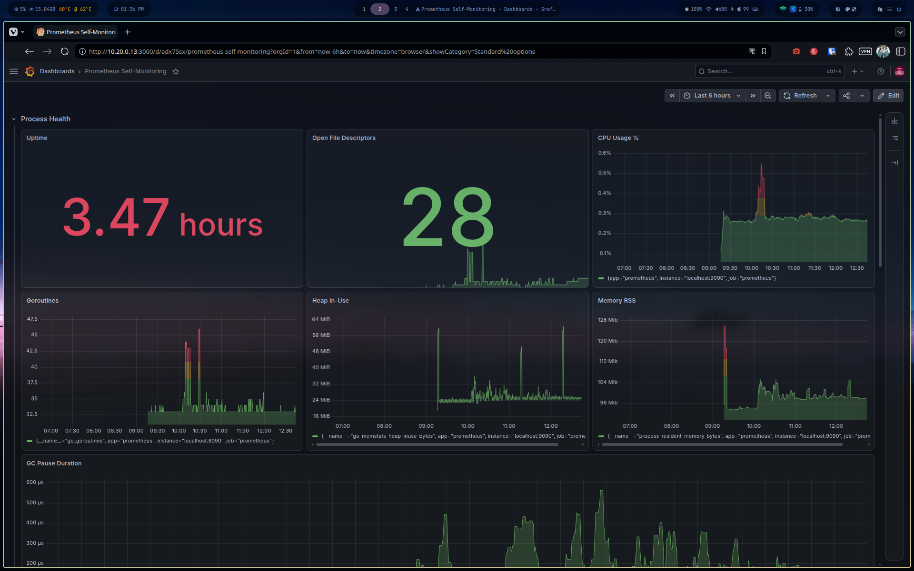
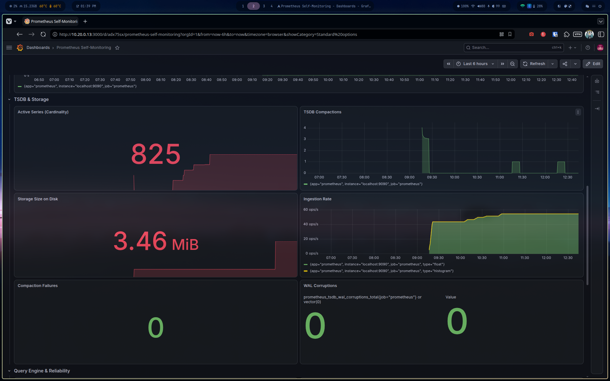
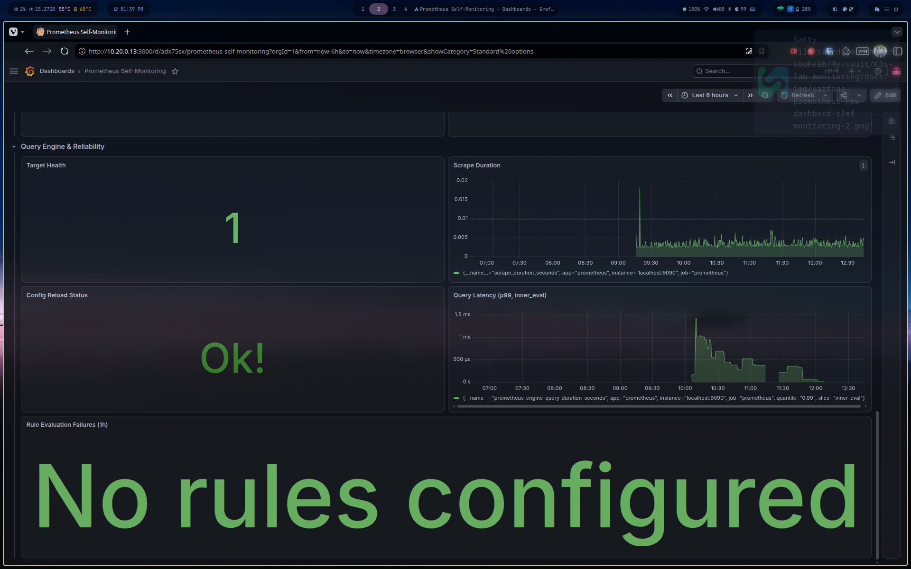
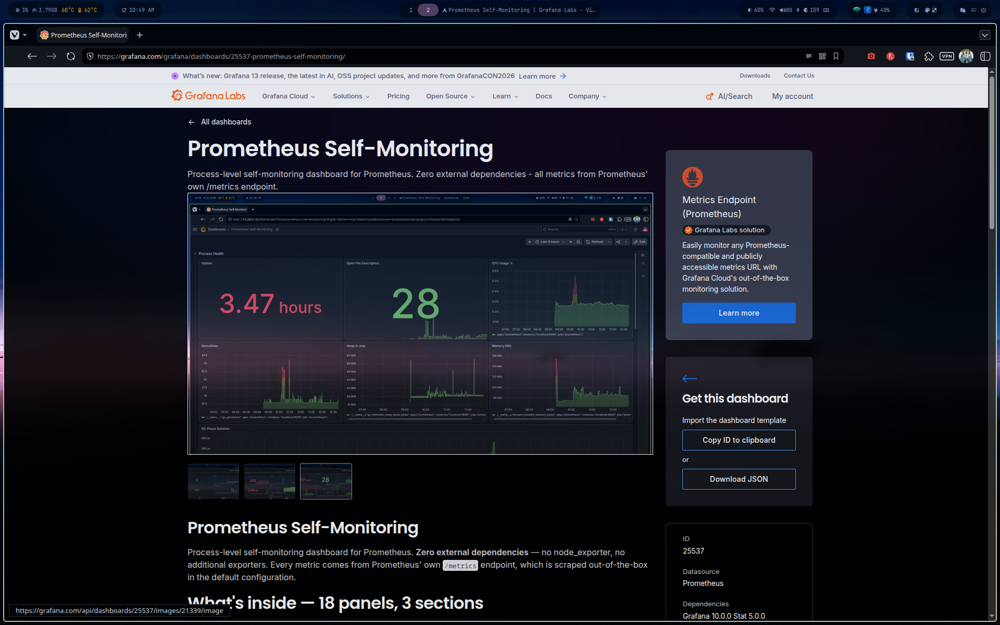

# Phase 7 — Prometheus Self-Monitoring Dashboard

## Objective

Build a custom Grafana dashboard from scratch to monitor the Prometheus 
server itself (process-level), as opposed to the cluster/K8s metrics it 
collects. Intended for community publication on Grafana.com.

## Scope decision

Zabbix agent already covers host-level metrics (RAM, disk, load) on 
Prometheus-srv. This dashboard deliberately covers **process-level only** 
to avoid duplicating Zabbix's job — see ADR-007.

## Structure — 18 panels, 3 rows

### Row 1 — Process Health (7 panels)
| Panel | Query |
|---|---|
| Uptime | `time() - process_start_time_seconds{job="prometheus"}` |
| Memory RSS | `process_resident_memory_bytes{job="prometheus"}` |
| CPU Usage % | `rate(process_cpu_seconds_total{job="prometheus"}[5m]) * 100` |
| Goroutines | `go_goroutines{job="prometheus"}` |
| Heap In-Use | `go_memstats_heap_inuse_bytes{job="prometheus"}` |
| GC Pause Duration | `rate(go_gc_duration_seconds_sum[5m]) / rate(go_gc_duration_seconds_count[5m])` |
| Open File Descriptors | `process_open_fds{job="prometheus"}` |

### Row 2 — TSDB & Storage (6 panels)
| Panel | Query |
|---|---|
| Active Series (Cardinality) | `prometheus_tsdb_head_series{job="prometheus"}` |
| TSDB Compactions | `increase(prometheus_tsdb_compactions_total[10m])` |
| Storage Size on Disk | `prometheus_tsdb_storage_blocks_bytes{job="prometheus"}` |
| Ingestion Rate | `rate(prometheus_tsdb_head_samples_appended_total[5m])` |
| Compaction Failures | `increase(prometheus_tsdb_compactions_failed_total[1h])` |
| WAL Corruptions | `prometheus_tsdb_wal_corruptions_total or vector(0)` |

### Row 3 — Query Engine & Reliability (5 panels)
| Panel | Query |
|---|---|
| Target Health | `up{job="prometheus"}` |
| Scrape Duration | `scrape_duration_seconds{job="prometheus"}` |
| Config Reload Status | `prometheus_config_last_reload_successful{job="prometheus"}` |
| Query Latency (p99, inner_eval) | `prometheus_engine_query_duration_seconds{quantile="0.99", slice="inner_eval"}` |
| Rule Evaluation Failures | `increase(prometheus_rule_evaluation_failures_total[1h])` |

## Key finding — Active Series as the leading indicator

`prometheus_tsdb_head_series` (cardinality) is the single best predictor 
of future memory pressure — a monotonic climb without plateau signals 
label explosion long before RSS or OOM becomes visible. This is the 
panel to watch first during incident triage.

## Bugs caught during construction

- **Memory RSS unit** initially set to `bits(IEC)` instead of `bytes(IEC)` 
  — caused a misleading 8x scale on the Y-axis; not visually obvious 
  because Grafana auto-formats the axis regardless of the unit chosen.
- **Threshold defaults left at `80`** on boolean-ish counters 
  (Compaction Failures, WAL Corruptions, Rule Evaluation Failures) — 
  Grafana's default threshold is 80, meaningless for panels that should 
  flip red at the first non-zero value. Corrected to `1`.
- **GC pause duration** attempted at `quantile="0.99"` — Go's native 
  summary metric only exposes fixed quantiles (0, 0.25, 0.5, 0.75, 1), 
  never 0.99. Switched to `rate(sum)/rate(count)` for a smoothed average 
  instead.
- **Open File Descriptors as a percentage** (`open_fds / max_fds * 100`) 
  rendered as ~0.005% because `max_fds` defaults to the systemd 
  `LimitNOFILE` (500K+) on modern Ubuntu — the ratio is meaningless 
  against an oversized limit. Switched to raw value display.

## Publication — Grafana.com

**Dashboard ID: [25537](https://grafana.com/grafana/dashboards/25537)**

### Blocker: schema v2 export incompatibility

Grafana 13.1's native "Export as code" flow produces a dashboard using 
the internal schema v2 (`elements`/`layout`), which requires an 
experimental feature toggle not enabled on any standard Grafana 
instance — including Grafana.com's own importer. Full root cause and 
fix path documented in 
[`docs/troubleshooting/grafana-dashboard-schemaV2-export-failure.md`](troubleshooting/grafana-dashboard-schemaV2-export-failure.md).

### Fix summary

1. Pulled the dashboard via the classic REST API 
   (`GET /api/dashboards/uid/<uid>`) instead of the UI export — returns 
   the legacy `panels[]` schema regardless of what the instance uses 
   internally.
2. Re-added fields the stripped-down export omits but that Grafana.com's 
   upload validator requires: `id: null`, `gnetId: null`, `tags: []`, 
   `links: []`, `__elements: {}`, and a complete `__requires` block 
   (grafana core + datasource + every panel type used).
3. Templated the datasource UID (`"uid": "${DS_PROMETHEUS}"`) with a 
   matching `templating.list` entry so any Grafana instance prompts for 
   a Prometheus datasource on import.

The missing `id: null` field was specifically the cause of Grafana.com's 
first rejection ("Old dashboard JSON format") — the validator treats its 
absence, not its `null` value, as an old-format signal.

### Listing

- **Title:** Prometheus Self-Monitoring
- **Category:** Templates
- **Short description:** Process-level self-monitoring for Prometheus. 
  Zero external dependencies — no node_exporter required.
- **Datasource:** Prometheus (job label must be `prometheus`, or the 
  panel queries need adjusting on import)

### Status

**Published.** Anyone can import via `Dashboards → Import → 25537` and 
select their Prometheus datasource. JSON kept in `dashboards/` for 
local reference and version tracking alongside the repo.
