# 08 — SOC Configuration (Wazuh)

This document is the reference procedure for configuring the SOC layer of the lab, from a fresh Wazuh install (see [03-wazuh.md](03-wazuh.md)) to a fully working SOC. It only describes the clean path. Every issue encountered while building this procedure is documented separately in [troubleshooting/wazuh-soc-troubleshooting.md](troubleshooting/wazuh-soc-troubleshooting.md) — referenced inline as `[TS-x]`.

Environment: Wazuh 4.14.6 all-in-one on Ubuntu 26.04 LTS (`10.20.0.11`). The installation assistant flags Ubuntu 26.04 as outside its recommended systems list; the deployment works and this is an accepted risk.

## Overview

| Capability | Scope | Status |
|---|---|---|
| Vulnerability Detection | Full host CVE scan via CTI feed | Operational — 2,900 findings |
| Active Response | SSH brute force → firewall drop | Tested in real conditions |
| Email Alerting | Alerts level ≥ 10 → Gmail via local Postfix relay | Tested — delivery confirmed |
| File Integrity Monitoring (FIM) | Stack config paths + sandbox, realtime | Tested |
| VirusTotal integration | FIM events → VirusTotal hash lookup | Tested — EICAR flagged 60/66 |
| SCA / MITRE ATT&CK / Compliance | Active by default | Active |

Configuration lives in `/var/ossec/etc/ossec.conf` and `/var/ossec/etc/local_internal_options.conf` on the manager. Fleet-wide agent deployment is Phase 5 (Ansible, ADR-006).

---


## 1. Post-install steps (required, in this order)

These three steps come before any capability configuration. Skipping any of them leads to silent failures documented in the troubleshooting reference.

### 1.1 Enable vulnerability scanning of the manager host

Wazuh does **not** scan the manager itself by default. On an all-in-one deployment where the manager is the only monitored host, Vulnerability Detection produces zero results without this line `[TS-1]`:

```bash
echo "vulnerability-detection.disable_scan_manager=0" | sudo tee -a /var/ossec/etc/local_internal_options.conf
```

### 1.2 Restart the manager once the indexer is healthy

The quickstart boot order causes the indexer connectors to fail during the manager's first inventory scan, losing the initial sync permanently `[TS-2]`. Wait for the cluster to report green, then restart the manager once:

```bash
curl -k -u admin:'<ADMIN_PASSWORD>' https://localhost:9200/_cluster/health?pretty
sudo systemctl restart wazuh-manager

# connectors must initialize cleanly:
sudo grep "indexer-connector" /var/ossec/logs/ossec.log | tail -5
```

This restart also applies the option from 1.1 — the log confirms it:

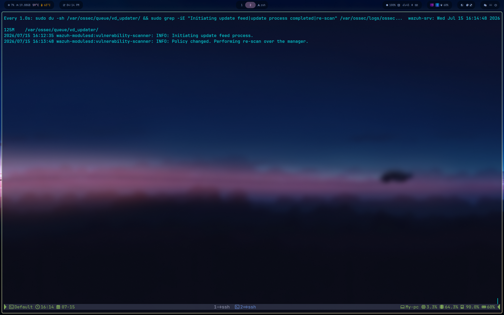

### 1.3 Freeze the Wazuh repository

Prevents a routine `apt upgrade` from replacing a working deployment (recommended by the official quickstart):

```bash
sudo sed -i 's/^deb/#deb/' /etc/apt/sources.list.d/wazuh.list && sudo apt update
```

Also disable update notifications in the dashboard (Server APIs → *Disable updates notifications*).

---

## 2. Vulnerability Detection

The module correlates the package inventory (collected by `syscollector`) with the CVE feed downloaded from Wazuh CTI (`cti.wazuh.com`) into `/var/ossec/queue/vd_updater/`. Matches are written to the `wazuh-states-vulnerabilities-*` index.

Enabled by default in `ossec.conf`:

```xml
<vulnerability-detection>
  <enabled>yes</enabled>
  <index-status>yes</index-status>
  <feed-update-interval>60m</feed-update-interval>
</vulnerability-detection>
```

### The first feed cycle

The first download is heavy and **must complete uninterrupted** — restarting the manager mid-cycle corrupts the feed state `[TS-3]`. A normal cycle:

| Marker | Expected value |
|---|---|
| Start | `Initiating update feed process.` |
| Duration | ~15–30 minutes |
| Peak size of `vd_updater/` | ~1 GB (download) then ~4.5 GB (ingestion) |
| Size at rest | ~40 MB (compacted) — normal, not a failure |
| End | `Feed update process completed.` + `Triggered a re-scan after content update.` |

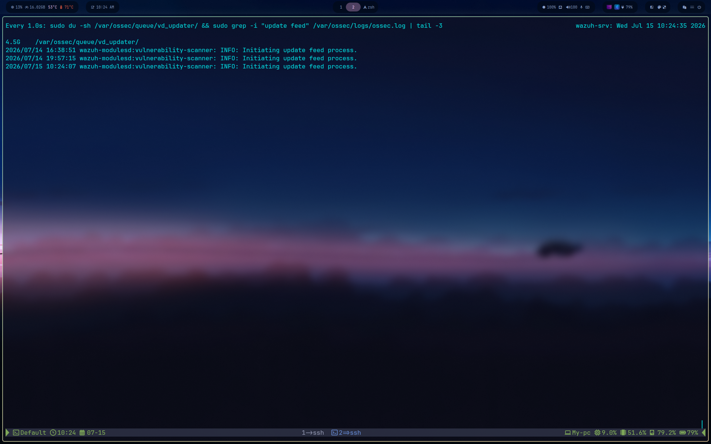

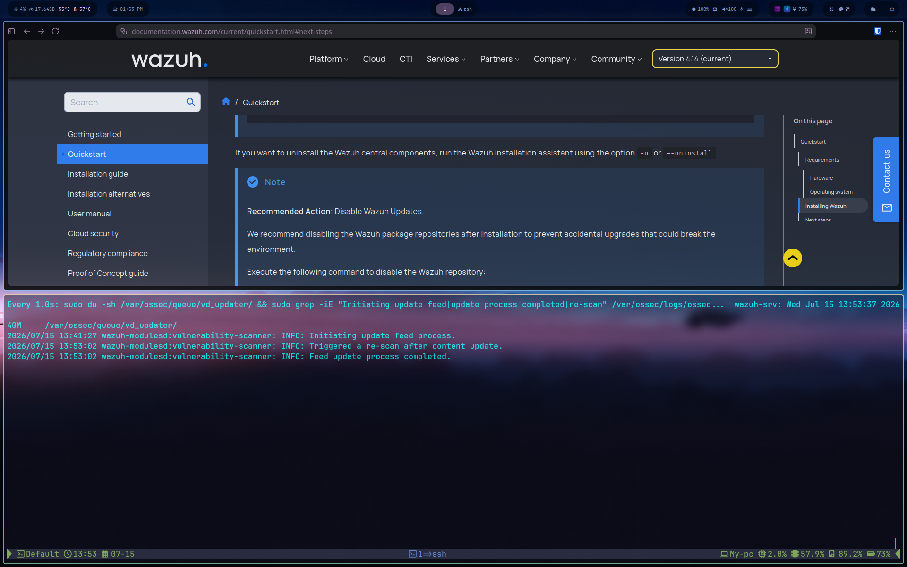

Monitor without intervening:

```bash
watch -n 60 'sudo du -sh /var/ossec/queue/vd_updater/ && sudo grep -iE "Initiating update feed|update process completed|re-scan" /var/ossec/logs/ossec.log | tail -3'
```

### Validation

Allow ~5 minutes after the post-feed re-scan, then:

```bash
curl -k -u admin:'<ADMIN_PASSWORD>' "https://localhost:9200/wazuh-states-vulnerabilities-*/_count?pretty"
```

This host: **2,900 findings** across all severities.

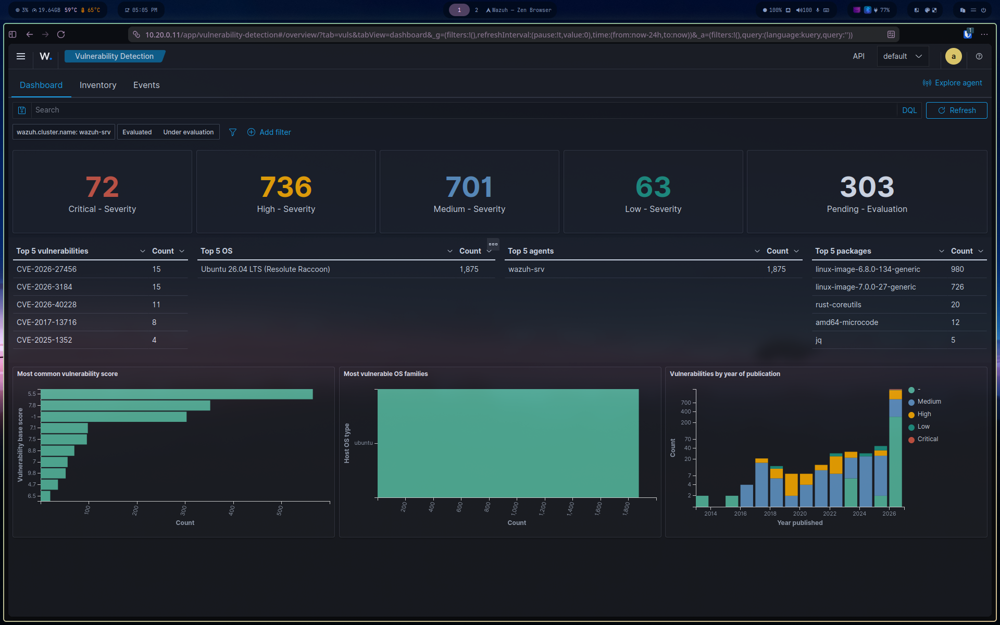

### Remediation

Filter by severity, patch the package, and the next scan clears the finding. On this host most findings sit on the two installed kernel images (a leftover of the 24.04 → 26.04 release upgrade); removing the old kernel (`apt autoremove` after booting the new one) clears them.

---

## 3. Active Response — SSH brute force

Repeated SSH authentication failures trigger an automatic firewall drop of the source IP.

| Rule ID | Meaning |
|---|---|
| 5712 | SSHD brute force — multiple authentication failures |
| 5720 | Multiple SSHD authentication failures (aggregated) |
| 5763 | SSHD brute force variant |

In `ossec.conf` — the block must sit **outside** the XML comment wrapping the default placeholder `[TS-4]`:

```xml
<active-response>
  <disabled>no</disabled>
  <command>firewall-drop</command>
  <location>local</location>
  <rules_id>5712,5720,5763</rules_id>
  <timeout>600</timeout>
</active-response>
```

- `firewall-drop` ships with Wazuh and inserts an iptables DROP rule for the offending IP.
- `location: local` — the response runs on the host that raised the alert. Fleet-wide coverage comes with Phase 5 agents.
- `timeout: 600` — the ban lifts after 10 minutes.

```bash
sudo systemctl restart wazuh-manager
```

### Validation — tested in real conditions

An SSH brute force launched from another VM (`10.20.0.253`) completed the full loop automatically: detection from journald logs → rule match → `firewall-drop` executed against the attacker.

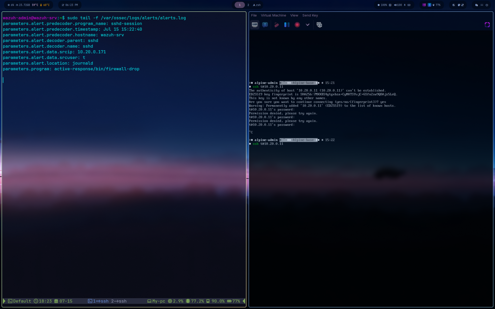

```bash
sudo tail -20 /var/ossec/logs/active-responses.log
sudo iptables -L INPUT -n | grep DROP    # attacker IP present during the 600s window
```

---

## 4. Email Alerting

Alerts of level 10 or higher are delivered by email. Wazuh's internal mail daemon cannot authenticate against modern SMTP providers `[TS-5]`, so a local Postfix relay bridges the gap:

```
wazuh-maild ──plain SMTP──▶ Postfix (127.0.0.1) ──TLS + auth──▶ smtp.gmail.com:587
```

### Postfix relay

```bash
sudo apt install postfix libsasl2-modules -y
# during install, select "Satellite system"
```

In `/etc/postfix/main.cf`:

```
relayhost = [smtp.gmail.com]:587
smtp_sasl_auth_enable = yes
smtp_sasl_password_maps = hash:/etc/postfix/sasl_passwd
smtp_sasl_security_options = noanonymous
smtp_tls_security_level = encrypt
smtp_tls_CAfile = /etc/ssl/certs/ca-certificates.crt
inet_interfaces = loopback-only
```

Credentials in `/etc/postfix/sasl_passwd` (requires a Gmail **App Password**):

```
[smtp.gmail.com]:587 <your-address>@gmail.com:<APP_PASSWORD>
```

```bash
sudo chmod 600 /etc/postfix/sasl_passwd
sudo postmap /etc/postfix/sasl_passwd
sudo systemctl restart postfix

# test the relay alone before touching Wazuh:
echo "relay test" | mail -s "Postfix relay test" <your-address>@gmail.com
```

### Wazuh side

In the `<global>` section of `ossec.conf` — double-check the recipient address for typos, a wrong domain fails silently at the relay `[TS-5]`:

```xml
<email_notification>yes</email_notification>
<smtp_server>127.0.0.1</smtp_server>
<email_from><your-address>@gmail.com</email_from>
<email_to><your-address>@gmail.com</email_to>
<email_maxperhour>12</email_maxperhour>
```

Threshold in the `<alerts>` section:

```xml
<email_alert_level>10</email_alert_level>
```

```bash
sudo systemctl restart wazuh-manager
```

### Validation — delivery confirmed

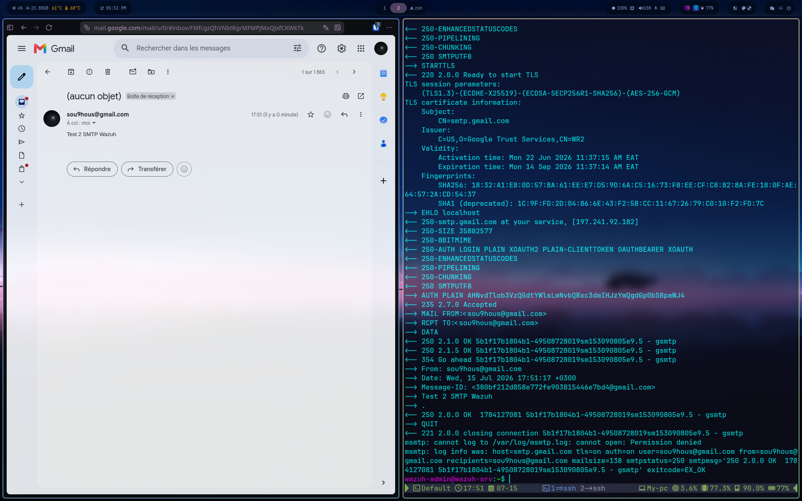

---

## 5. File Integrity Monitoring (FIM)

FIM ships enabled on standard system paths with a 12-hour periodic scan. It is extended with **realtime** detection on the monitoring stack's own configuration and on a sandbox directory used by the VirusTotal integration (section 6.1).

In the `<syscheck>` block, after the default `<directories>` entries:

```xml
<directories realtime="yes">/etc/prometheus,/etc/grafana,/etc/zabbix</directories>
<directories realtime="yes">/var/lib/grafana</directories>
<directories realtime="yes">/var/ossec/etc</directories>
<directories realtime="yes" check_all="yes">/root/malware-test</directories>
```

`check_all="yes"` on the sandbox is required so FIM computes file hashes — the VirusTotal integration needs the hash to query.

> A realtime watch is placed only on directories that **exist at the time syscheck starts**. If you create a monitored directory after the last restart, restart the manager once so the watch is registered `[TS-6]`.

```bash
sudo systemctl restart wazuh-manager
sudo grep -i "real-time" /var/ossec/logs/ossec.log | tail -3
```

### Validation

```bash
sudo touch /var/ossec/etc/fim-test && sudo rm /var/ossec/etc/fim-test
```

Alerts appear in **File Integrity Monitoring → Events** (rules 554 added / 550 modified / 553 deleted), with full forensic detail — mode realtime, before/after MD5/SHA1/SHA256.

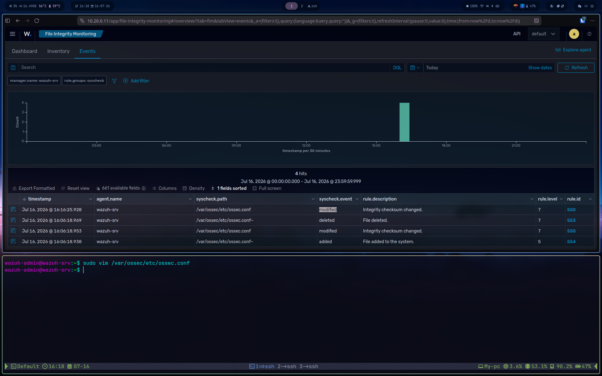


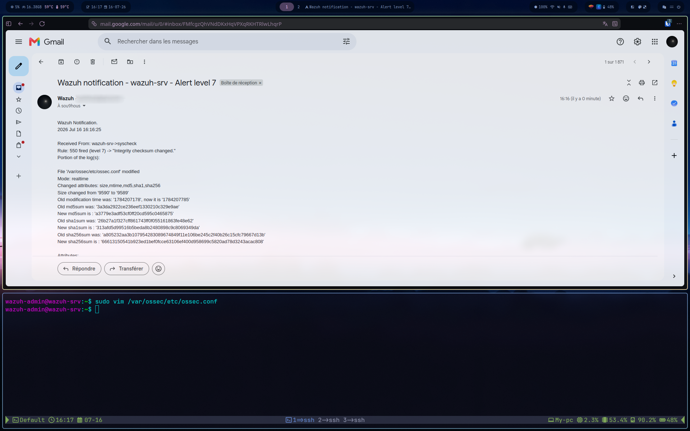

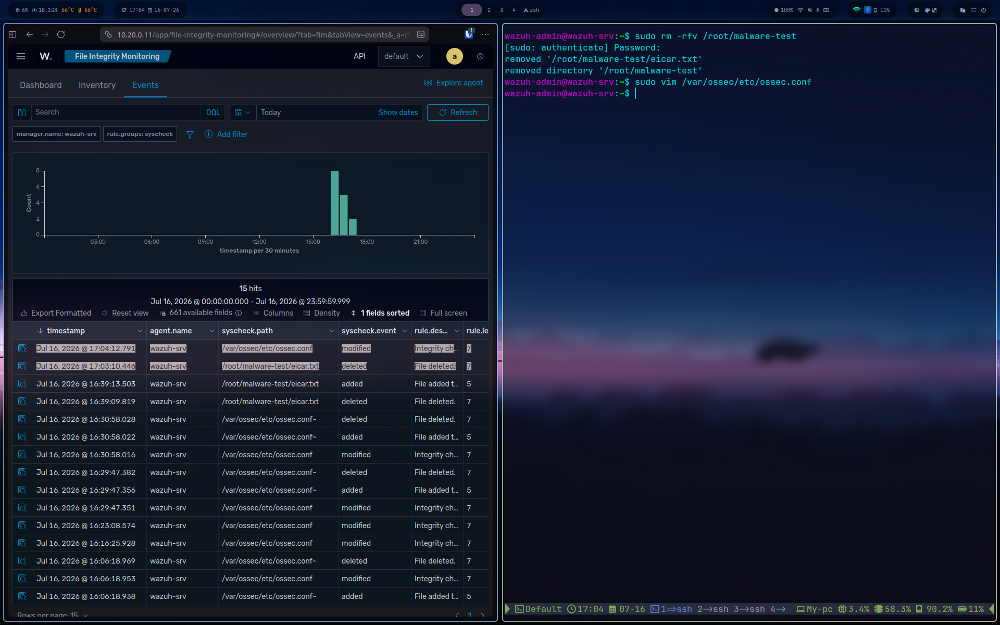

### 5.1 VirusTotal integration

Each FIM event on a monitored file sends its SHA256 to the VirusTotal API, which returns how many antivirus engines flag the file. A clean change stays a normal FIM alert; a known-malicious hash raises a high-severity VirusTotal alert (rule 87105).

```
FIM (syscheck) ──SHA256──▶ integratord ──API──▶ VirusTotal ──▶ enriched alert (rule 87105)
```

**API key.** Create a free VirusTotal account (500 requests/day, 4/min) and copy the API key from the account profile. The key lives only in `ossec.conf` on the VM — never commit it. In this repo it is shown as a placeholder.

**Configuration.** As a direct child of `<ossec_config>` (sibling of `<syscheck>`, **not** inside it — a misplaced block prevents the manager from starting `[TS-7]`):

```xml
<integration>
  <name>virustotal</name>
  <api_key>YOUR_VT_API_KEY</api_key>
  <group>syscheck</group>
  <alert_format>json</alert_format>
</integration>
```

```bash
sudo systemctl restart wazuh-manager
sudo /var/ossec/bin/wazuh-control status | grep integrator   # must be running
sudo grep -i "Enabling integration for: 'virustotal'" /var/ossec/logs/ossec.log | tail -1
```

**Validation with EICAR** — the standard antivirus test file, harmless, recognised by every engine. Copy the string exactly:

```bash
sudo mkdir -p /root/malware-test
echo 'X5O!P%@AP[4\PZX54(P^)7CC)7}$EICAR-STANDARD-ANTIVIRUS-TEST-FILE!$H+H*' | sudo tee /root/malware-test/eicar.txt
```

Within ~60 seconds the chain fires: FIM detects the new file → VirusTotal is queried → rule 87105 raises a level-12 alert. On this host, EICAR was flagged by **60 of 66 engines**, with a clickable link to the VirusTotal report in the alert.

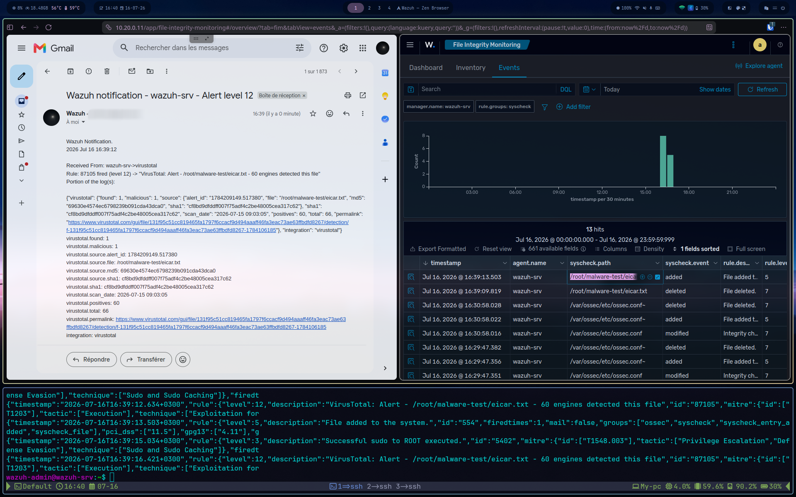

```bash
sudo grep -iE "virustotal|87105" /var/ossec/logs/alerts/alerts.json | tail -3
```

In the UI: Threat Hunting → `rule.id: 87105`.

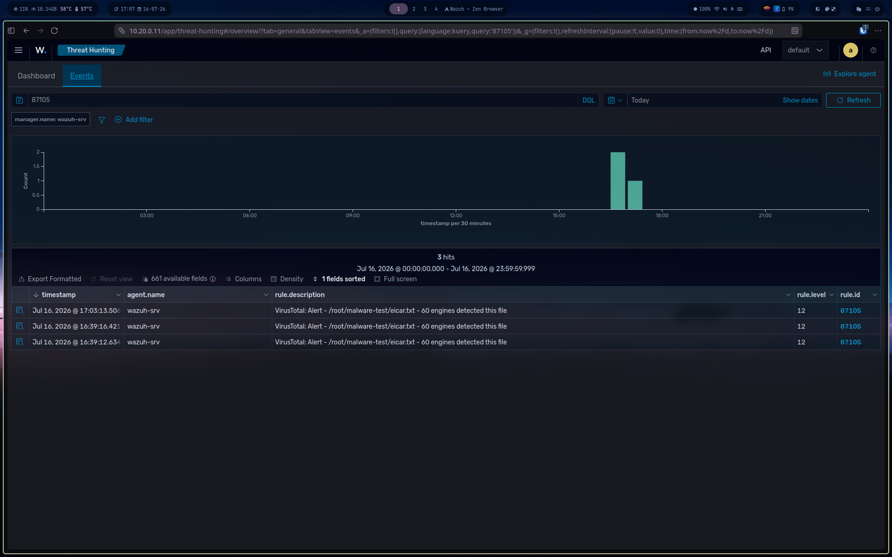

---

## 6. SCA, MITRE ATT&CK, Compliance

Active out of the box, no configuration required:

- **SCA** — evaluates the host against the CIS benchmark matching the detected OS. Results under **Configuration Assessment**.
- **MITRE ATT&CK** — alerts are automatically tagged with the corresponding tactic/technique.
- **Regulatory Compliance** — alerts carry PCI DSS, GDPR, HIPAA and NIST 800-53 tags.

---

## References

- Installation walkthrough: [03-wazuh.md](03-wazuh.md)
- Architecture decisions: ADR-003, ADR-006 in [DECISIONS.md](../DECISIONS.md)
- Issues encountered while building this procedure: [troubleshooting/wazuh-soc-troubleshooting.md](troubleshooting/wazuh-soc-troubleshooting.md)
