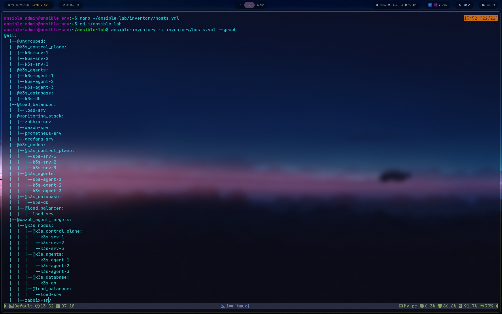
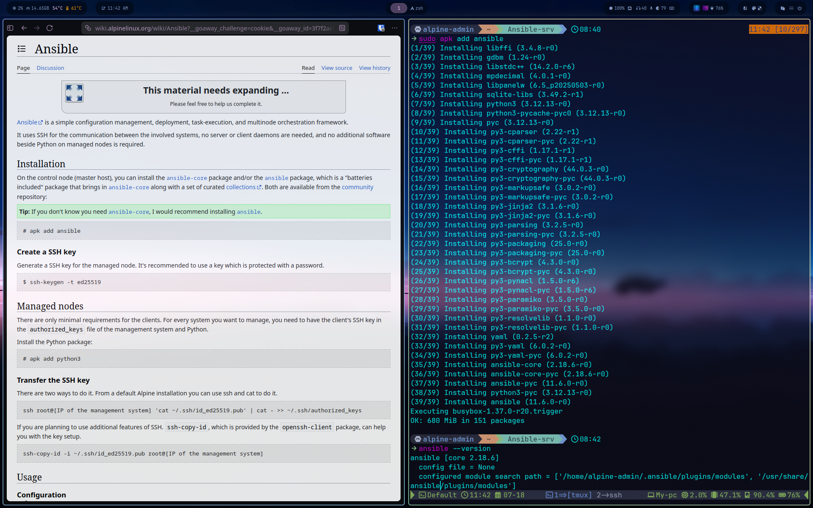
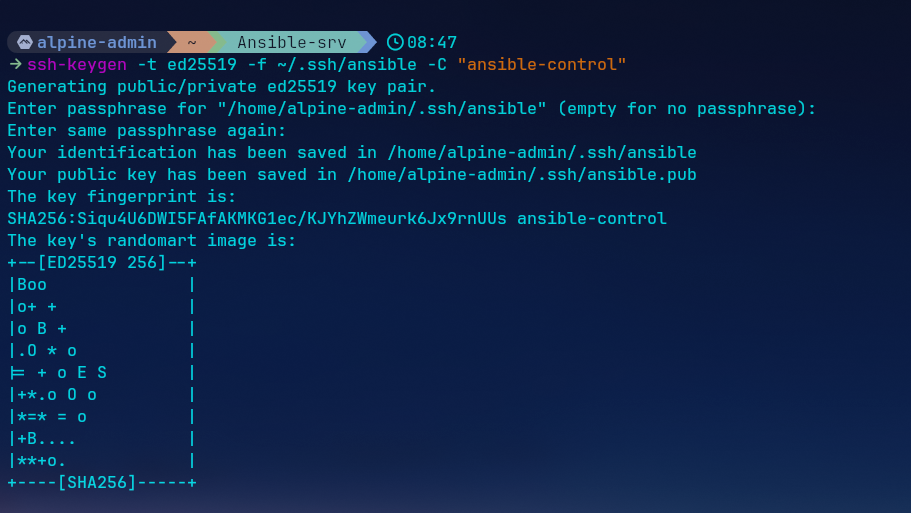
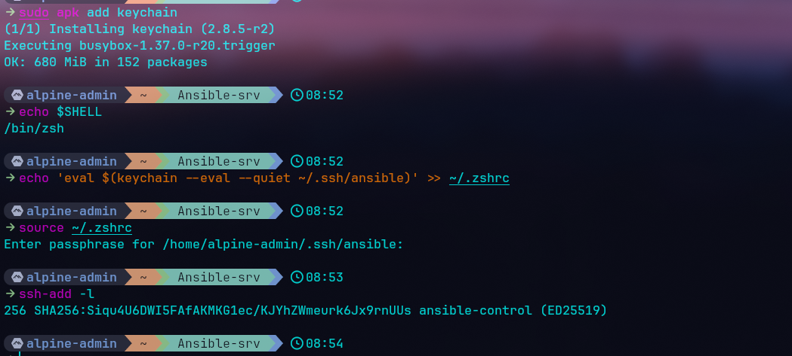
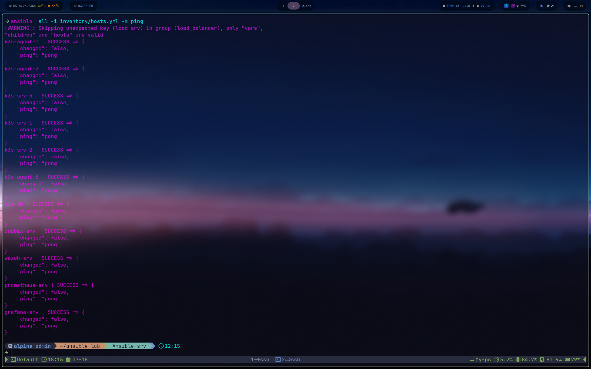
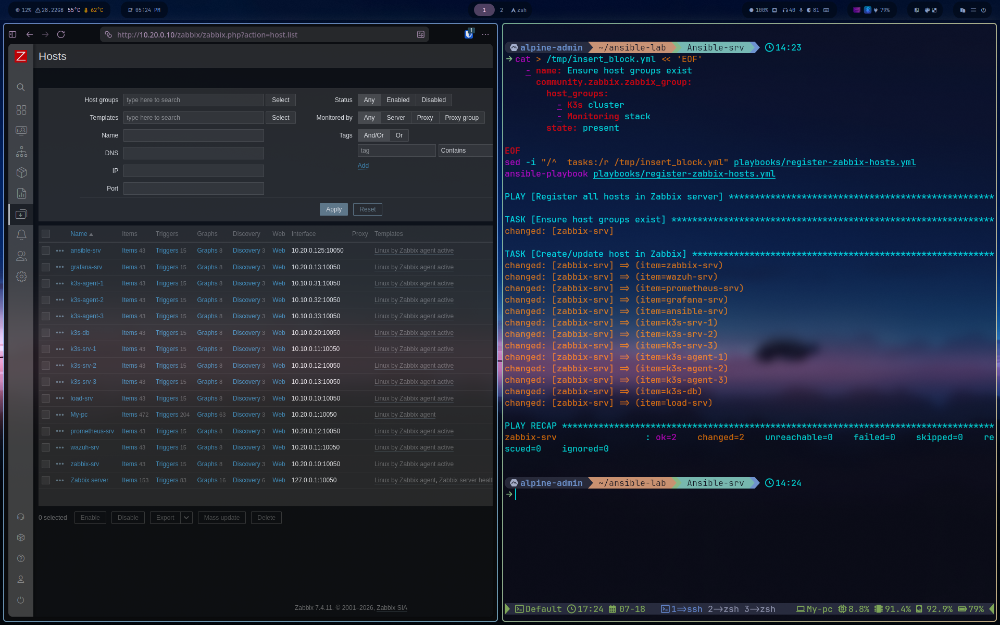
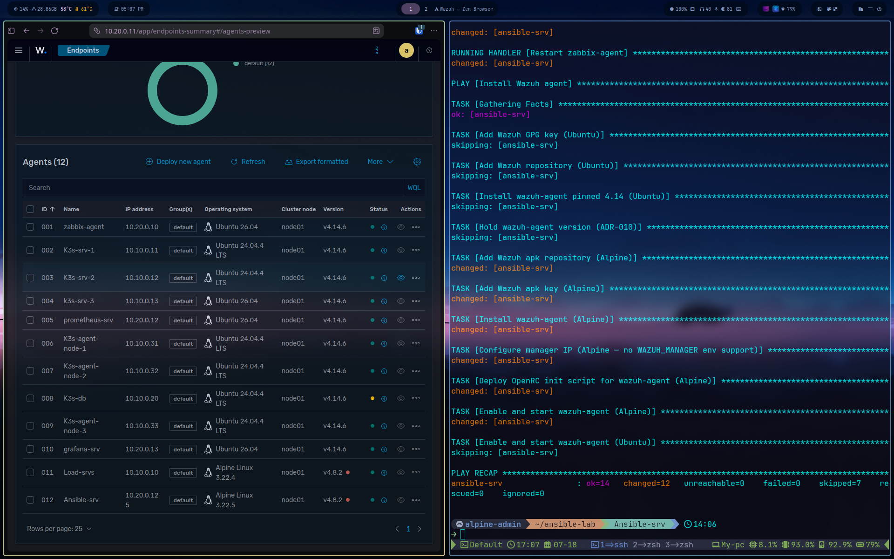
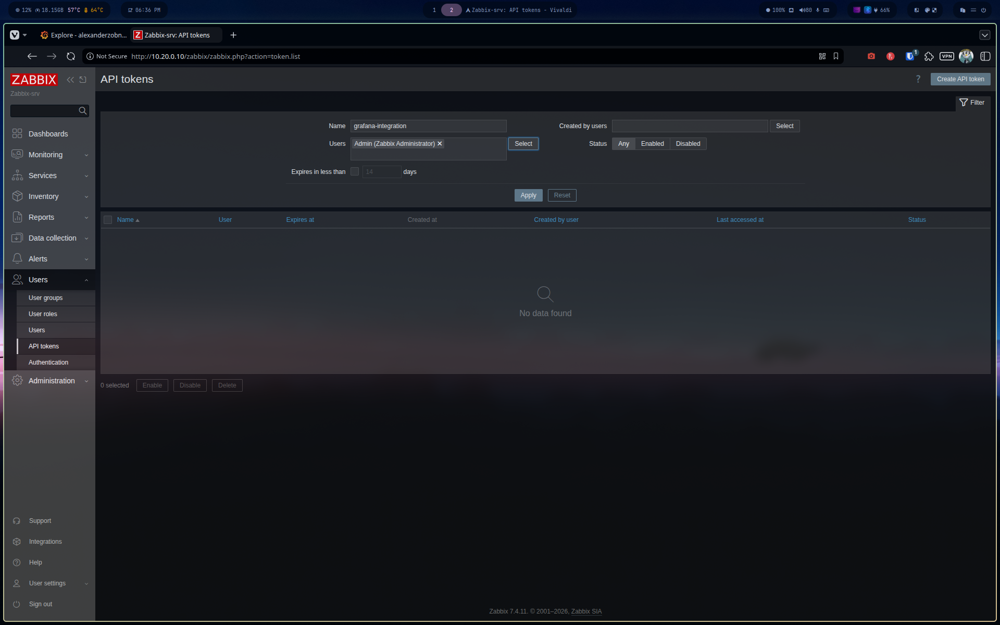
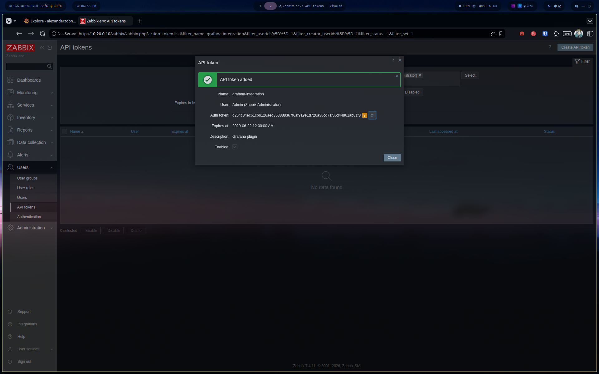

# 09: Ansible Automation (Phase 5)

Automated deployment of monitoring agents (Zabbix + Wazuh) across the whole lab,
and registration of all hosts in the Zabbix server through its API.

## 1. Architecture

The control node is a dedicated Alpine Linux VM on monitoring-net:

| Item | Value |
|---|---|
| Control node | `ansible-srv`: Alpine Linux, 10.20.0.125 (static DHCP reservation) |
| Ansible | ansible 11.x (full bundle via `apk add ansible`, includes `community.general`, `community.zabbix`, `ansible.posix`) |
| Managed hosts | 13 (6 K3s nodes, k3s-db, load-srv, 4 monitoring VMs, the control node itself) |
| Auth | SSH key `~/.ssh/ansible` (passphrase held by keychain) + passwordless sudo on every host |

Alpine was chosen for the control node for its minimal footprint (see ADR-011).
The control node manages itself through `ansible_connection: local`.

**Scope exclusions** (see ADR-012): OPNsense (FreeBSD, not a standard
SSH/Python target) and the hypervisor (trust hierarchy: the control node must
not hold root on its own host) are intentionally outside Ansible's perimeter.



## 2. Prerequisites

Before any playbook run, every managed host needs:

1. **The public key deployed**, `ssh-copy-id -i ~/.ssh/ansible.pub <user>@<ip>`
2. **Passwordless sudo**, `/etc/sudoers.d/<user>` with `NOPASSWD: ALL` (mode 0440).
   Note: some sudo builds use a non-standard password prompt that Ansible's
   become detection does not match ("Timeout waiting for privilege escalation
   prompt"); deploying the sudoers file over plain SSH avoids the issue entirely.
3. **Bidirectional routing**, every k3s-net host must hold a return route to
   `10.20.0.0/24` via OPNsense (10.10.0.254). Ping and SSH succeeding is *not*
   sufficient proof: small exchanges survive an asymmetric path, but Ansible's
   SFTP module transfer will hang silently. Verify `ip route show` on the target.








## 3. Repository layout

```
configs/ansible/
├── ansible.cfg                  # default inventory, key, pipelining
├── files/
│   └── wazuh-agentd.initd       # custom OpenRC init script (Alpine)
├── inventory/
│   ├── hosts.yml                # 13 hosts, functional + logical groups
│   └── group_vars/all/
│       ├── main.yml             # zabbix_server_ip, wazuh_manager_ip, wazuh_version, api url
│       ├── secrets.yml          # zabbix_api_token, GITIGNORED
│       └── secrets.yml.example  # template with CHANGEME
└── playbooks/
    ├── install-agents.yml
    └── register-zabbix-hosts.yml
```

The inventory defines functional groups (`k3s_control_plane`, `k3s_agents`,
`k3s_database`, `load_balancer`, `monitoring_stack`, `ansible_control`) and
logical aggregation groups used as play targets (`k3s_nodes`,
`zabbix_agent_targets`, `wazuh_agent_targets`; the latter excludes wazuh-srv,
which runs the native agent 000).

## 4. Playbook: install-agents.yml

Two plays, one per agent. OS-specific work is grouped in `block:` sections with
a single `when: ansible_os_family` condition; shared configuration uses a
`loop` over key/value pairs.

**Zabbix agent**: official 7.4 repo on Ubuntu (`apt`), community repo on
Alpine (`apk`). Configuration sets `Server`, `ServerActive` and
`Hostname={{ inventory_hostname }}` so active checks match the names registered
in the server. Service name differs by init system: `zabbix-agent` (systemd) vs
`zabbix-agentd` (OpenRC); resolved once in a play-level var.

**Wazuh agent**: on Ubuntu, version is pinned to `4.14.*` and held via
`dpkg_selections` to keep agents in lockstep with the manager (ADR-010). The
`WAZUH_MANAGER` environment variable is consumed by the package postinst. On
Alpine the apk package (4.8.2, latest available, ADR-010 amendment) supports
neither the env variable nor ships an init script: the manager IP is patched
into `ossec.conf` and a custom OpenRC init script
(`files/wazuh-agentd.initd`, wrapping `/var/ossec/bin/wazuh-control`) is
deployed and enabled.

The playbook is fully idempotent: a second run reports `changed=0` on all 13
hosts.



## 5. Playbook: register-zabbix-hosts.yml

A Zabbix agent only listens; the server must be told about each host. The
playbook drives the Zabbix API through the `community.zabbix` collection v3
(httpapi connection plugin, token auth):

- One play targeting `zabbix-srv`, `gather_facts: false`
- `zabbix_group` ensures the host groups exist (v3 no longer auto-creates them)
- `zabbix_host` loops over `groups['zabbix_agent_targets']`, creating each host
  with its inventory IP, the **Linux by Zabbix agent active** template (agents
  push to 10051, so no inbound 10050 firewall rule is needed), and a host group
  derived from inventory membership

Result: 15 hosts green in Monitoring → Hosts (13 managed + hypervisor + Zabbix
server itself).





## 6. Secrets management

The API token lives in `inventory/group_vars/all/secrets.yml`, which is
gitignored; a `secrets.yml.example` with a `CHANGEME` placeholder is committed
instead. Files inside `group_vars/all/` are all loaded for the `all` group;
a file named `secrets.yml` directly under `group_vars/` would be silently
ignored (it matches no group name).





## 7. Verification

```
ansible all -m ping                      # 13/13 pong
ansible all -m command -a whoami --become  # 13× root, no prompt
ansible-playbook playbooks/install-agents.yml        # changed=0 everywhere
ansible-playbook playbooks/register-zabbix-hosts.yml # ok, changed=0
```

## 8. Known limitations & assumed exceptions

- **Alpine Wazuh agents run 4.8.2** (latest apk build) against a 4.14 manager:
  protocol-compatible, but excluded from Vulnerability Detection scans.
  Documented as an accepted exception to ADR-010.
- **OPNsense and the hypervisor are out of scope** (ADR-012).
- The lab-wide rule stands: heavyweight non-lab VMs (My-pnet, Win11) never run
  alongside the full lab, host RAM is capped at ~33 GiB allocated for 31 GiB
  physical after the 18/07 incident.
