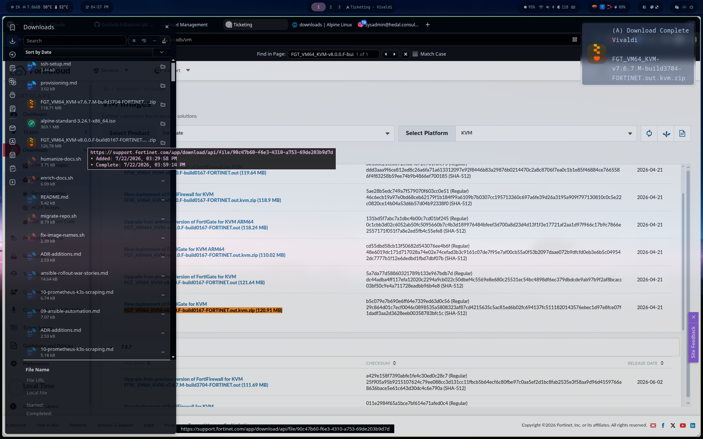
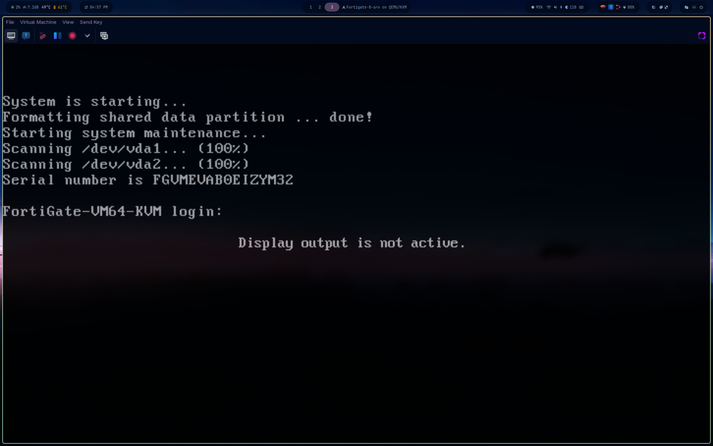

# Phase 7 — Migrating from OPNsense to FortiGate

Replacing the OPNsense router VM with a FortiGate VM, keeping the same IPs and routes so nothing downstream (Zabbix, Wazuh, Prometheus, Ansible) needs to change.

See [ADR-013](../../DECISIONS.md) for the reasoning.

## 1. Image acquisition

FortiGate-VM deployment packages require a free FortiCloud account and are downloaded from the Customer Service & Support site (Download > VM Images > Product: FortiGate, Platform: KVM). The permanent evaluation license, not a time-limited trial, applies to KVM/private-cloud deployments — one free copy per FortiCloud account.

## 2. VM deployment

Deployed via `virt-install`/`virt-clone` on the same libvirt host as the rest of the lab, attached to the two existing bridges (`k3s-net`, `monitoring-net`) that OPNsense currently uses — nothing on the network side changes yet, only the router VM itself.

## 3. Licensing

Registered against FortiCloud to activate the permanent evaluation license (limited features/capacity, one CPU/2GB RAM ceiling under evaluation — enough for a lab router).

## 4. Cutover plan

- [ ] OPNsense powered off but not deleted (rollback path)
- [ ] Same IPs assigned: WAN 10.10.0.254, LAN 10.20.0.254
- [ ] Policies recreated: allow k3s-net <-> monitoring-net on the ports currently in use (Zabbix agent, Wazuh agent, Prometheus scrape)
- [ ] Outbound NAT disabled on inter-VLAN policies — same asymmetric-routing pitfall hit with libvirt's masquerade chain applies here
- [ ] Validated: ping both directions, Zabbix hosts green, Wazuh agents active, Prometheus targets up
- [ ] OPNsense VM deleted once stable

## Status

**Blocked** — FortiGate VM was deployed and licensed, but the cutover plan requires more interfaces, firewall policies, and routes than the permanent evaluation license allows (3 each). See [ADR-013 Amendment](DECISIONS.md#adr-013-amendment--migration-blocked-by-evaluation-license-limits) for the full reasoning. OPNsense remains the active router; the FortiGate VM is retained powered off in case a licensed version becomes available.