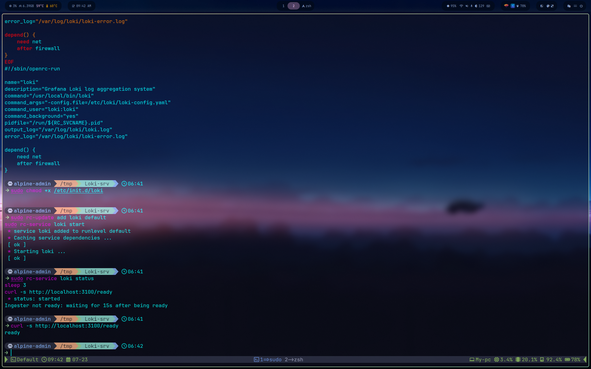
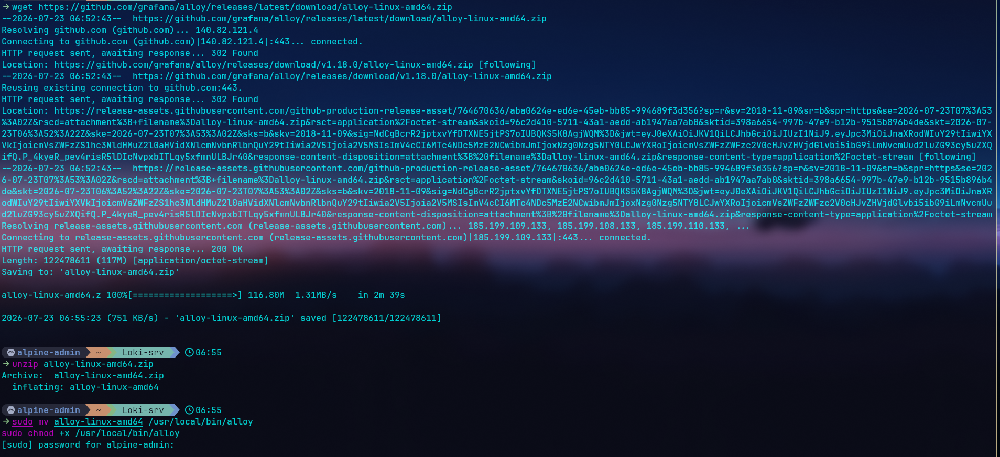
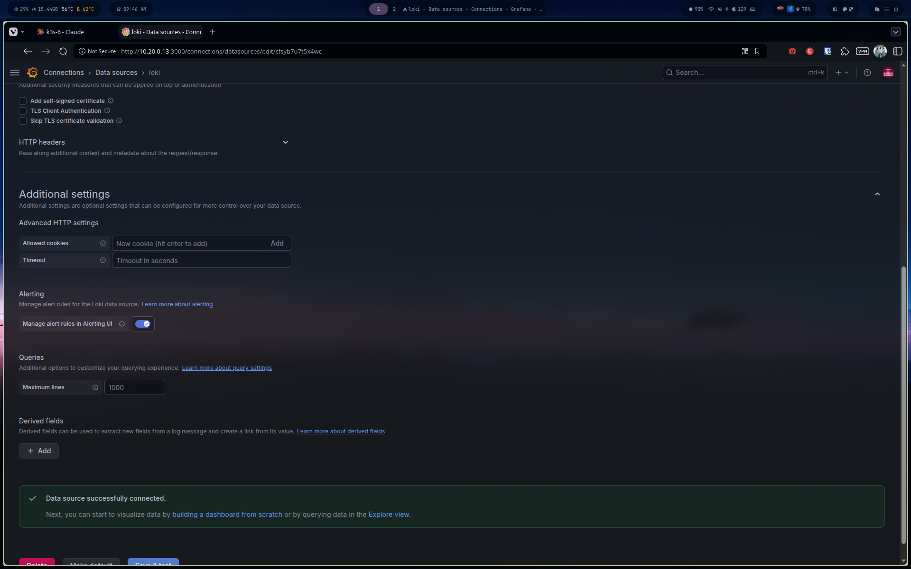
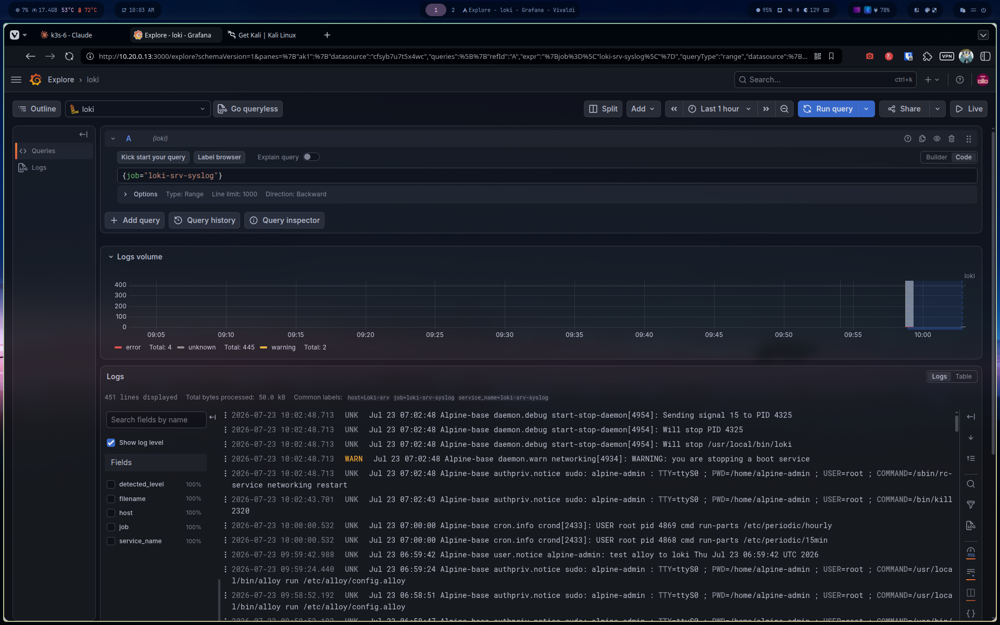

# Phase 7 — Log Aggregation (Loki + Alloy)

Adding a logging pillar alongside the existing metrics (Prometheus) and security (Wazuh) stacks. Loki collects and stores logs; Alloy is the agent that ships them from each host.

## 1. VM

`Loki-srv` follows the same pattern as every other Alpine VM in the lab: cloned from `Alpine-base`, attached to `monitoring-net`.

```bash
sudo virt-clone \
  --original Alpine-base \
  --name Loki-srv \
  --file /var/lib/libvirt/images/Loki-srv.qcow2
```

**Spec:** 1 vCPU, 1024 MB RAM — same footprint as the bastion and Ansible control node.

Hostname and static IP follow the lab's addressing convention (`.10` Zabbix, `.11` Wazuh, `.12` Prometheus, `.13` Grafana, `.14` Loki):

```
# /etc/network/interfaces
auto lo
iface lo inet loopback

auto eth0
iface eth0 inet static
    address 10.20.0.14
    netmask 255.255.255.0
    gateway 10.20.0.254
```

## 2. Outbound NAT — a lab-wide fix, found here

Loki-srv could reach every other network in the lab but not the internet — `apk update` timed out silently. OPNsense's outbound NAT was set to **Disabled**, a side effect of the fix applied for direct inter-network routing (see ADR-002): disabling NAT stopped it from rewriting source addresses between `k3s-net`, `monitoring-net`, and `bastion-net`, but it also stopped NAT from working for traffic actually leaving the lab.

Fix: switch outbound NAT mode from **Disable** to **Hybrid** (Firewall > NAT > Outbound). Hybrid keeps the router's own manual/system rules while still auto-generating NAT for everything else, including the WAN egress every host needs for `apk`/`apt` updates.

```bash
# Verified after the change — both still work
ping -c3 8.8.8.8        # internet
ping -c3 10.10.0.254     # inter-network routing via OPNsense
```

This affects every VM in the lab, not just Loki-srv — see the updated [ADR-002](../../DECISIONS.md).

## 3. Loki installation

No Alpine package exists for Loki; the official static binary is used instead.

```bash
wget https://github.com/grafana/loki/releases/latest/download/loki-linux-amd64.zip
sudo apk add unzip
unzip loki-linux-amd64.zip
sudo mv loki-linux-amd64 /usr/local/bin/loki
sudo chmod +x /usr/local/bin/loki
```

A dedicated, unprivileged user runs the service:

```bash
sudo adduser -D -H -s /sbin/nologin loki
sudo mkdir -p /var/lib/loki/{chunks,rules,compactor} /var/log/loki
sudo chown -R loki:loki /var/lib/loki /var/log/loki
```

### Config — single binary, filesystem storage, 7-day retention

```yaml
auth_enabled: false

server:
  http_listen_port: 3100
  grpc_listen_port: 9096

common:
  path_prefix: /var/lib/loki
  storage:
    filesystem:
      chunks_directory: /var/lib/loki/chunks
      rules_directory: /var/lib/loki/rules
  replication_factor: 1
  ring:
    instance_addr: 127.0.0.1
    kvstore:
      store: inmemory

schema_config:
  configs:
    - from: 2026-01-01
      store: tsdb
      object_store: filesystem
      schema: v13
      index:
        prefix: index_
        period: 24h

limits_config:
  retention_period: 168h
  reject_old_samples: true
  reject_old_samples_max_age: 168h

compactor:
  working_directory: /var/lib/loki/compactor
  compaction_interval: 10m
  retention_enabled: true
  retention_delete_delay: 2h
  delete_request_store: filesystem
```

Loki 3.7.x requires `delete_request_store` whenever retention is enabled — omitting it fails config validation on startup with a clear error naming the missing field.

### OpenRC service

```bash
#!/sbin/openrc-run
name="loki"
description="Grafana Loki log aggregation system"
command="/usr/local/bin/loki"
command_args="-config.file=/etc/loki/loki-config.yaml"
command_user="loki:loki"
command_background="yes"
pidfile="/run/${RC_SVCNAME}.pid"
output_log="/var/log/loki/loki.log"
error_log="/var/log/loki/loki-error.log"

depend() {
    need net
    after firewall
}
```

```bash
sudo rc-update add loki default
sudo rc-service loki start
curl -s http://localhost:3100/ready   # -> ready
```



## 4. Alloy installation

Same static-binary approach as Loki. Alpine is musl-based; the official Alloy build links against glibc, so the binary fails with a misleading `no such file or directory` error even though the file is present — `ldd` reveals the real cause (missing `ld-linux-x86-64.so.2`). `gcompat` provides the glibc compatibility layer Alpine needs to run it.

```bash
wget https://github.com/grafana/alloy/releases/latest/download/alloy-linux-amd64.zip
unzip alloy-linux-amd64.zip
sudo mv alloy-linux-amd64 /usr/local/bin/alloy
sudo chmod +x /usr/local/bin/alloy

sudo apk add gcompat   # fixes "no such file or directory" on a file that exists
alloy --version
```



### Minimal config — tail local syslog, push to local Loki

```river
local.file_match "system_logs" {
	path_targets = [{
		__path__ = "/var/log/messages",
		job      = "loki-srv-syslog",
		host     = "Loki-srv",
	}]
}

loki.source.file "system_logs" {
	targets    = local.file_match.system_logs.targets
	forward_to = [loki.write.local.receiver]
}

loki.write "local" {
	endpoint {
		url = "http://localhost:3100/loki/api/v1/push"
	}
}
```

### OpenRC service

```bash
#!/sbin/openrc-run
name="alloy"
description="Grafana Alloy telemetry collector"
command="/usr/local/bin/alloy"
command_args="run /etc/alloy/config.alloy --storage.path=/var/lib/alloy"
command_user="root:root"
command_background="yes"
pidfile="/run/${RC_SVCNAME}.pid"
output_log="/var/log/alloy/alloy.log"
error_log="/var/log/alloy/alloy-error.log"

depend() {
    need net
    after firewall loki
}
```

```bash
sudo rc-update add alloy default
sudo rc-service alloy start
```

## 5. Grafana datasource

Connections > Data sources > Add data source > Loki, URL `http://10.20.0.14:3100`. Confirmed with **Save & test**.



## 6. End-to-end validation

```bash
logger "test alloy to loki $(date)"
```

Queried in Grafana Explore against the Loki datasource:

```logql
{job="loki-srv-syslog"}
```

The test line appears, confirming the full path: syslog -> Alloy tail -> Loki push -> Grafana query.



## 7. Persistence check

The same stale-`udhcpc` issue hit during Bastion-lab provisioning reappeared here: a leftover DHCP client silently reassigned the interface after boot, overwriting the static IP. Killing the process and restarting networking fixed it immediately; a full reboot afterward confirmed the static IP, Loki, and Alloy all come back up correctly with no manual intervention.

```bash
ps aux | grep udhcpc
sudo kill <pid>
sudo rc-service networking restart
```

## What's not done yet

- Alloy deployment to the other 12 lab hosts via Ansible (this VM was the pilot).
- A basic Grafana logs dashboard.
- Syslog hostname still shows the pre-rename `Alpine-base` in log lines — cosmetic, same class of fix as the bastion's syslog restart.